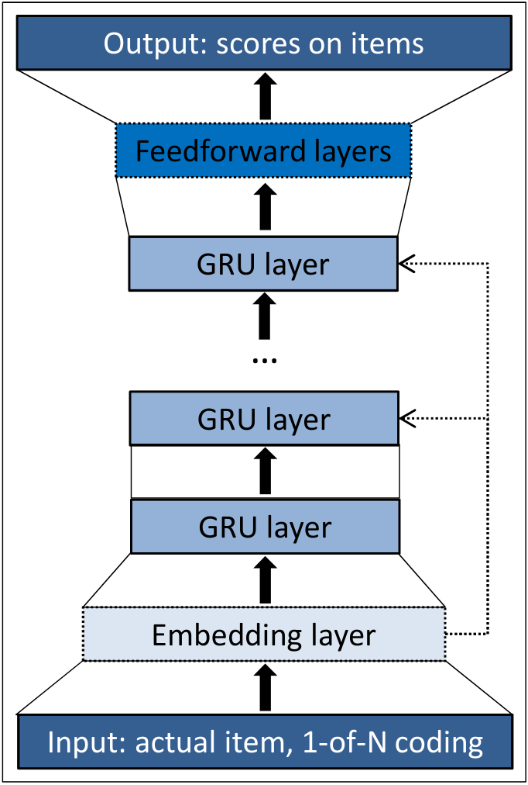

# Session-based Recommendations with Recurrent Neural Networks

Balázs Hidasi, Alexandros Karatzoglou, Linas Baltrunas, Domonkos Tikk  
ICLR 2016 / arXiv:1511.06939

> GRU を session-based recommendation に適用し、Item-KNN を上回る性能を示した初期の代表論文。

---

## どんなもの？

- ユーザ ID や長期履歴が使えない **session-based recommendation** のための RNN 手法
- session 内の click sequence を GRU で逐次的に model 化
- 次に click / watch される item を ranking する
- 後に **GRU4Rec** と呼ばれる、session-based recommendation の古典的 baseline

> 「最後に見た item だけ」ではなく「session 全体の流れ」を使う推薦。

---

## 背景: session-based recommendation が必要な場面

- 小規模 EC やニュース・メディアでは user-id を長期追跡できないことが多い
- cookie / fingerprinting は不安定で privacy concern もある
- user が 1-2 session しか持たない場合、長期 profile を作れない
- classified site などでは同一 user でも session ごとに intent が違うことがある

> 長期 user profile を前提にした推薦ではなく、短い session の中だけで次 item を予測する必要がある。

---

## 課題: 既存手法は何を見落とすか

- 実務では item-to-item similarity / co-occurrence / transition probability がよく使われる
- これらは強いが、多くの場合 **最後の click** に強く依存する
- Session 内の過去 click の sequence 情報を十分に使えない
- Matrix factorization は user profile がないため直接適用しにくい

| 手法 | 問題 |
|---|---|
| Matrix factorization | user vector が作れない |
| Item-KNN | 主に現在 item との類似だけを見る |
| Markov chain | 長い履歴を state に含めると state space が爆発 |

---

## 先行研究と比べてどこがすごい？

- Recommender systems に RNN / GRU を本格適用
- Session 全体を hidden state として保持し、次 item を予測
- 大規模 item set に対応するため output sampling を導入
- Recommendation に合う ranking loss（BPR / TOP1）を使う
- RSC15 と VIDEO の 2 dataset で Item-KNN を大きく上回る

> 深層学習を「session-based recommendation の実務問題」に合わせて改造した点が貢献。

---

## 技術や手法のキモ

::: two-col

### GRU で session を読む

- input: 現在 click された item
- hidden state: session の文脈
- output: 次 item になる likelihood / score
- item は 1-of-N encoding

### 推薦向けの修正

- session-parallel mini-batch
- mini-batch 内 item を negative sample として使う
- pairwise ranking loss
- large item set でも訓練可能にする

:::

> RNN そのものより、推薦タスクに合わせた訓練設計が重要。

---

## Architecture

- GRU layer が session state を保持
- 複数 GRU layer も試したが、単層が最良
- embedding layer より 1-of-N encoding が良好
- output layer は item score を出す

---

## Session-parallel mini-batch

- NLP の sliding window mini-batch は session 推薦に合わない
- session 長は 2 event から数百 event まで大きく異なる
- session の時間発展を壊さずに mini-batch 化する
- session 終了時に対応する hidden state を reset

---

## Loss: なぜ ranking loss か

- 推薦の本質は item の relevance ranking
- Classification 的な cross-entropy は不安定になりやすい
- Pairwise ranking loss が有効

| Loss | 役割 |
|---|---|
| BPR | positive item が negative item より高 score になるようにする |
| TOP1 | relevant item の relative rank を近似し、negative score を 0 付近に正則化 |

> 著者は BPR と TOP1 を推奨し、TOP1 は 2 dataset でやや良い性能を示す。

---

## どうやって有効だと検証した？

- Dataset 1: RecSys Challenge 2015（RSC15）
- Dataset 2: YouTube-like OTT video service platform（VIDEO）
- 評価: session event を 1 つずつ与え、next event item の rank を見る
- Metrics: Recall@20, MRR@20
- Baselines: POP, S-POP, Item-KNN, BPR-MF

| Dataset | Train | Test |
|---|---|---|
| RSC15 | 7,966,257 sessions / 31,637,239 clicks / 37,483 items | 15,324 sessions / 71,222 events |
| VIDEO | 約 300 万 sessions / 約 1,300 万 watch events / 33 万 videos | 約 3.7 万 sessions / 約 18 万 events |

---

## Baseline 結果

| Baseline | RSC15 Recall@20 | RSC15 MRR@20 | VIDEO Recall@20 | VIDEO MRR@20 |
|---|---:|---:|---:|---:|
| POP | 0.0050 | 0.0012 | 0.0499 | 0.0117 |
| S-POP | 0.2672 | 0.1775 | 0.1301 | 0.0863 |
| Item-KNN | 0.5065 | 0.2048 | 0.5508 | 0.3381 |
| BPR-MF | 0.2574 | 0.0618 | 0.0692 | 0.0374 |

- Item-KNN が最強 baseline
- POP / BPR-MF は session 推薦では弱い
- 以後の主比較は Item-KNN との比較

---

## 主結果: GRU4Rec は Item-KNN を上回る

| Loss / Units | RSC15 Recall@20 | RSC15 MRR@20 | VIDEO Recall@20 | VIDEO MRR@20 |
|---|---:|---:|---:|---:|
| Item-KNN | 0.5065 | 0.2048 | 0.5508 | 0.3381 |
| TOP1 / 100 | 0.5853 | 0.2305 | 0.6141 | 0.3511 |
| BPR / 100 | 0.6069 | 0.2407 | 0.5999 | 0.3260 |
| TOP1 / 1000 | 0.6206 | 0.2693 | 0.6624 | 0.3891 |
| BPR / 1000 | 0.6322 | 0.2467 | 0.6311 | 0.3136 |

> TOP1 1000 は VIDEO で Recall@20 +20.27%、MRR@20 +15.08%。BPR 1000 は RSC15 Recall@20 +24.82%。

---

## 実験から見えた設計判断

- GRU が classic RNN / LSTM より良かった
- 単層 GRU が最良で、多層化は悪化
- item embedding より 1-of-N encoding が良かった
- session の全 previous event を入力に足しても改善しなかった
- hidden units を 100 から 1000 に増やすと pairwise loss は改善
- cross-entropy は数値的に不安定になりやすい

> Session が短いので、多層で複数 time scale を持つ必要は小さい、という解釈。

---

## 議論・限界

- 2016 年時点の古典的 RNN baseline であり、現在の attention / transformer / graph 系とは比較していない
- VIDEO dataset は recommendation algorithm が既に user behavior に影響していた可能性がある
- Item content は使わず、item ID sequence のみを使う
- Cross-entropy は不安定で、loss 設計への依存が大きい
- session-based なので長期 user preference は扱わない

> 「匿名 session の次 item 予測」には強いが、personalized long-term recommendation とは別問題。

---

## 次に読むべき論文

- BPR: Bayesian Personalized Ranking from Implicit Feedback
- Amazon item-to-item collaborative filtering
- Recurrent Neural Networks with Top-k Gains for Session-based Recommendations
- NARM: Neural Attentive Session-based Recommendation
- STAMP: Short-Term Attention/Memory Priority Model
- SR-GNN: Session-based Recommendation with Graph Neural Networks
- SASRec / BERT4Rec: transformer-based sequential recommendation

---

## まとめ

- **どんなもの？** GRU を使って session 内 click sequence から next item を ranking する手法
- **何がすごい？** user profile なしの session-based recommendation で Item-KNN を明確に上回る
- **手法のキモ** session-parallel mini-batch、output sampling、pairwise ranking loss
- **検証** RSC15 と VIDEO で Recall@20 / MRR@20 を評価し、約 20-30% の改善を報告
