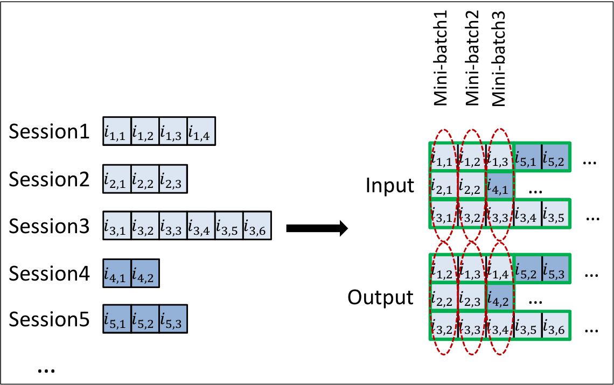

# Session-based Recommendations with Recurrent Neural Networks

Balázs Hidasi, Alexandros Karatzoglou, Linas Baltrunas, Domonkos Tikk  
Published as a conference paper at ICLR 2016  
arXiv:1511.06939

## Abstract

本論文では、recurrent neural networks（RNN）を新しい領域、すなわち recommender systems に適用する。現実の推薦システムは、Netflix のような長いユーザ履歴ではなく、短い session-based data のみに基づいて推薦しなければならない問題にしばしば直面する。この状況では、しばしば称賛される matrix factorization approach は正確ではない。実務では通常、この問題は item-to-item recommendation、すなわち類似 item を推薦することによって克服される。

我々は、session 全体をモデル化することで、より正確な推薦を提供できると主張する。したがって、session-based recommendation のための RNN-based approach を提案する。我々のアプローチは、このタスクの実務的側面も考慮し、この特定の問題に対してより実用的にするため、ranking loss function など classic RNN へのいくつかの修正を導入する。2 つの dataset における実験結果は、広く用いられている approach に対して明確な改善を示す。

## 1 Introduction

Session-based recommendation は、machine learning および recommender systems community において比較的十分に評価されていない問題である。多くの e-commerce recommender system、特に小規模小売業者のもの、ならびにニュース・メディアサイトの多くは、サイトを訪問する user の user-id を長期間にわたって通常は追跡しない。cookie や browser fingerprinting はある程度の user 認識性を提供できるが、これらの技術は十分に信頼できないことが多く、さらに privacy concern も引き起こす。

たとえ追跡が可能であっても、小規模 e-commerce site では多くの user が 1 つか 2 つの session しか持たず、特定の domain、たとえば classified site では user behavior が session-based な特徴を示すことが多い。したがって、同じ user の後続 session も独立に扱われるべきである。その結果、e-commerce に導入されている多くの session-based recommendation system は、user profile を使わない比較的単純な方法、たとえば item-to-item similarity、co-occurrence、transition probability に基づいている。これらの方法は有効ではあるが、多くの場合、user の最後の click または selection のみを考慮し、過去の click の情報を無視する。

Recommender systems で最も一般的に用いられる方法は factor model と neighborhood method である。Factor model は、疎な user-item interaction matrix を、dataset 内の各 item および user に対する d 次元 vector の集合へ分解する。推薦問題は matrix completion / reconstruction 問題として扱われ、latent factor vector は、対応する user-item latent factor の dot product などによって欠損 entry を埋めるために用いられる。Session-based recommendation では user profile が存在しないため、factor model の適用は困難である。一方、item または user 間の similarity 計算に依存する neighborhood method は、session または user profile 内の item co-occurrence に基づく。Neighborhood method は session-based recommendation で広く用いられてきた。

近年、deep neural network は image recognition や speech recognition など多くの task で大きな成功を収めてきた。Sequential data modeling も近年多くの注目を集めており、さまざまな種類の RNN がこの種の data に対する代表的 model となっている。Sequence modeling の応用は、test-translation、conversation modeling、image captioning に及ぶ。

RNN は上述の domain において顕著な成功を収めてきたが、recommender systems 領域ではほとんど注目されてこなかった。本研究では、RNN が session-based recommendation に顕著な結果をもって適用できると主張し、このような sparse sequential data を model 化する際に生じる問題に対処する。また、これらの model の training task に適した新しい ranking loss function を導入することで、RNN model を recommender setting に適応させる。

Session-based recommendation problem は、sequence を扱うという点でいくつかの NLP 関連問題と類似している。Session-based recommendation では、user が website に入って最初に click した item を RNN の initial input とみなし、その initial input に基づいて推薦を問い合わせることができる。User の各 consecutive click は、それまでのすべての click に依存する output、すなわち recommendation を生成する。Recommender system で選択対象となる item set は、通常、数万から数十万に及ぶ。Item set の大きさに加えて、click-stream dataset は通常かなり大きいため、training time と scalability が非常に重要である。多くの information retrieval および recommendation setting と同様に、user が興味を持つ可能性のある top item に modeling power を集中させることが重要であり、この目的のために RNN の training に ranking loss function を用いる。

## 2 Related work

### 2.1 Session-based recommendation

Recommender systems における多くの研究は、user identifier が利用可能で、明確な user profile を構築できる場合に機能する model に焦点を当ててきた。この setting では、matrix factorization method と neighborhood model が文献を支配してきており、online でも用いられている。

Session-based recommendation で用いられる主要 approach の 1 つであり、user profile が欠けている問題に対する自然な解決策は item-to-item recommendation approach である。この setting では、利用可能な session data から item-to-item similarity matrix を事前計算する。すなわち、session 内でしばしば一緒に click される item は類似しているとみなされる。この similarity matrix は、session 中に user が現在 click している item に最も類似する item を推薦するために単純に用いられる。単純ではあるが、この方法は有効であることが示され、広く使われている。しかし、これらの方法は user の最後の click のみを考慮し、実質的に過去の click の情報を無視する。

Session-based recommendation に対するやや異なる approach として Markov Decision Processes（MDP）がある。MDP は sequential stochastic decision problem の model である。MDP は 4-tuple $\langle S, A, Rwd, tr \rangle$ として定義される。ここで、$S$ は state の集合、$A$ は action の集合、$Rwd$ は reward function、$tr$ は state-transition function である。Recommender systems では action は recommendation と同一視でき、最も単純な MDP は本質的に first order Markov chain である。この場合、次の recommendation は item 間の transition probability に基づいて単純に計算できる。Session-based recommendation に Markov chain を適用する際の主な問題は、user selection のすべての可能な sequence を含めようとすると、state space が急速に扱いにくくなることである。

General Factorization Framework（GFF）の拡張版は、recommendation に session data を用いることができる。これは session をその event の和として model 化する。Item に対して 2 種類の latent representation を用い、1 つは item そのものを表し、もう 1 つは session の一部としての item を表す。その後、session は part-of-a-session item representation の feature vector の平均として表現される。しかし、この approach は session 内の ordering を考慮しない。

### 2.2 Deep Learning in Recommenders

Neural network 文献における初期の関連手法の 1 つは、Collaborative Filtering に Restricted Boltzmann Machines（RBM）を用いるものである。この研究では、RBM を用いて user-item interaction を model 化し、recommendation を行う。この model は、最良の Collaborative Filtering model の 1 つであることが示されている。Deep model は、音楽や画像などの unstructured content から feature を抽出し、それをより従来型の collaborative filtering model と組み合わせて用いるためにも使われてきた。たとえば、convolutional deep network を用いて music file から feature を抽出し、それを factor model で用いる研究がある。より最近では、deep network を用いて任意の type の item から generic content feature を抽出し、それらを standard collaborative filtering model に組み込む汎用 approach が提案された。この approach は、十分な user-item interaction 情報がない setting で特に有用であると考えられる。

## 3 Recommendations with RNNs

Recurrent Neural Networks は variable-length sequence data を model 化するために考案された。RNN と conventional feedforward deep model の主な違いは、network を構成する unit に internal hidden state が存在することである。Standard RNN は以下の update function を用いて hidden state $h$ を更新する。

$$
\mathbf{h_t} = g(W\mathbf{x_t} + U\mathbf{h_{t-1}})
$$

ここで、$g$ は logistic sigmoid function などの smooth and bounded function であり、$\mathbf{x_t}$ は time $t$ における unit の input である。RNN は、current state $\mathbf{h_t}$ が与えられたとき、sequence の次の element に対する probability distribution を output する。

Gated Recurrent Unit（GRU）は、vanishing gradient problem に対処することを目的とした、より精巧な RNN unit model である。GRU gate は、unit の hidden state をいつ、どれだけ update するかを本質的に学習する。GRU の activation は、previous activation と candidate activation $\mathbf{\hat{h_t}}$ の linear interpolation である。

$$
\mathbf{h_t} = (1-\mathbf{z_t})\mathbf{h_{t-1}} + \mathbf{z_t}\mathbf{\hat{h_t}}
$$

update gate は以下で与えられる。

$$
\mathbf{z_t} = \sigma(W_z\mathbf{x_t} + U_z\mathbf{h_{t-1}})
$$

candidate activation function $\mathbf{\hat{h_t}}$ は同様に以下で計算される。

$$
\mathbf{\hat{h_t}} = \mathrm{tanh}\left({W\mathbf{x_t} + U(\mathbf{r_t} \odot \mathbf{h_{t-1}})}\right)
$$

最後に reset gate $\mathbf{r_t}$ は以下で与えられる。

$$
\mathbf{r_t} = \sigma(W_r\mathbf{x_t} + U_r\mathbf{h_{t-1}})
$$

### 3.1 Customizing the GRU model

我々は、session-based recommendation の model に GRU-based RNN を用いた。Network の input は session の actual state であり、output は session 内の next event の item である。Session の state は、actual event の item、またはこれまでの session 内の event のどちらかにできる。前者の場合、1-of-N encoding を用いる。すなわち、input vector の長さは item 数に等しく、active item に対応する coordinate だけが 1 で、他は 0 である。後者の setting では、これらの representation の weighted sum を用い、より早く発生した event は discount される。Stability のために input vector は normalized される。これは memory effect、すなわち RNN の長期 memory では十分に捉えられない非常に local な ordering constraint の reinforcement を強めるため、有効であると期待される。Additional embedding layer を追加する実験も行ったが、1-of-N encoding が常により良い性能を示した。

Network の core は GRU layer であり、last layer と output の間に additional feedforward layer を追加できる。Output は item の predicted preference、すなわち session 内で next になる likelihood である。複数の GRU layer を用いる場合、previous layer の hidden state が next layer の input になる。Input は network のより深い GRU layer に optional に接続することもでき、これは performance を改善することが分かった。全体の architecture は Figure 1 に示されており、event stream 内の 1 つの event の representation を描いている。

Recurrent neural network は recommender systems を主要な application area としていないため、我々は base network をこの task により適合するよう修正した。また、live environment に適用可能にするための実務的な点も考慮した。

#### 3.1.1 Session-parallel mini-batches

Natural language processing task における RNN は通常、in-sequence mini-batch を用いる。たとえば、sentence の word に対して sliding window を用い、windowed fragment を横に並べて mini-batch を形成することが一般的である。しかし、これは我々の task には適合しない。理由は、(1) session の長さは sentence よりもさらに大きく異なることがあり、2 event の session もあれば数百 event に及ぶ session もあること、(2) 我々の goal は session が time とともにどのように発展するかを捉えることであり、fragment に分割することは意味をなさないことである。

したがって、我々は session-parallel mini-batch を用いる。まず session に順序を作る。次に、最初の $X$ session の first event を用いて first mini-batch の input を形成する。このとき desired output は active session の second event である。Second mini-batch は second event から形成され、以後同様である。いずれかの session が終了した場合、次に利用可能な session がその場所に置かれる。Session は独立であると仮定されるため、この switch が起こると該当する hidden state を reset する。詳細は Figure 2 に示す。

#### 3.1.2 Sampling on the output

Recommender systems は item 数が大きい場合に特に有用である。中規模の webshop でも item 数は数万規模であり、大規模 site では数十万、場合によっては数百万 item も珍しくない。各 step で全 item に対して score を計算すると、algorithm は item 数と event 数の積に比例して scale し、実用上使えない。したがって、output を sample し、小さな item subset に対してのみ score を計算する必要がある。これは、weight の一部だけが update されることも意味する。Desired output に加えて、いくつかの negative example に対する score を計算し、desired output が高く rank されるように weight を修正する必要がある。

任意の missing event の自然な解釈は、user がその item の存在を知らず、したがって interaction がなかったというものである。しかし user がその item を知っていて、嫌ったために interaction しなかった可能性も低いながら存在する。Item が popular であるほど、user がその item を知っている可能性は高く、したがって missing event が dislike を表す可能性も高い。そのため、item は popularity に比例して sample すべきである。

各 training example ごとに separate sample を生成する代わりに、我々は mini-batch 内の他の training example の item を negative example として用いる。この approach の利点は、sampling を省略することで computational time をさらに削減できることである。さらに、code を単純にし、matrix operation を高速化できる実装上の利点もある。同時に、この approach は popularity-based sampling でもある。mini-batch 内の他の training example に item が含まれる likelihood は、その popularity に比例するためである。

#### 3.1.3 Ranking loss

Recommender systems の core は、item の relevance-based ranking である。この task は classification task としても解釈できるが、learning-to-rank approach は一般に他の approach より優れている。Ranking は pointwise、pairwise、listwise に分類できる。Pointwise ranking は item の score または rank を独立に推定し、relevant item の rank が低くなるように loss を定義する。Pairwise ranking は positive item と negative item の pair の score または rank を比較し、positive item の rank が negative item より低くなるよう loss を課す。Listwise ranking はすべての item の score と rank を用い、perfect ordering と比較する。Sorting を含むため通常は computationally expensive であり、あまり用いられない。また、我々の場合のように relevant item が 1 つだけである場合、listwise ranking は pairwise ranking で解ける。

我々はいくつかの pointwise および pairwise ranking loss を solution に含めた。この network では pointwise ranking が unstable であることが分かった。一方、pairwise ranking loss は良好に機能した。以下の 2 つを用いる。

- **BPR**: Bayesian Personalized Ranking は pairwise ranking loss を用いる matrix factorization method である。Positive item と sampled negative item の score を比較する。ここでは positive item の score を複数の sampled item と比較し、その平均を loss として用いる。Session 内のある point における loss は、$N_S$ を sample size、$\hat{r}_{s,k}$ を session のその point における item $k$ の score、$i$ を desired item、$j$ を negative sample として、$L_s=-\\frac{1}{N_S}\\cdot\\sum_{j=1}^{N_S}{\\mathrm{log}(\\sigma(\\hat{r}_{s,i}-\\hat{r}_{s,j}))}$ と定義される。
- **TOP1**: この ranking loss は本 task のために我々が考案した。これは relevant item の relative rank の regularized approximation である。Relevant item の relative rank は $\frac{1}{N_S}\cdot\sum_{j=1}^{N_S}{I\{\hat{r}_{s,j}>\hat{r}_{s,i}\}}$ で与えられる。我々は $I\{\cdot\}$ を sigmoid で近似する。これを最適化すると、item $i$ の score が高くなるように parameter が修正される。しかし、特定の positive item も negative example として機能するため、score が次第に高くなり続け、これは unstable である。これを避けるため、negative example の score を 0 付近に強制する。この期待は negative item の score に対して自然である。したがって loss に regularization term を追加する。Final loss function は $L_s=\frac{1}{N_S}\cdot\sum_{j=1}^{N_S}{\sigma(\hat{r}_{s,j}-\hat{r}_{s,i})+\sigma(\hat{r}_{s,j}^2)}$ である。

## 4 Experiments

我々は、提案した recurrent neural network を 2 つの dataset において popular baseline と比較して評価する。

最初の dataset は RecSys Challenge 2015 の dataset である。この dataset は e-commerce site の click-stream を含み、時には purchase event で終了する。本研究では challenge の training set を用い、click event のみを保持する。長さ 1 の session は除外する。Network は約 6 か月分の data で訓練され、7,966,257 session、31,637,239 click、37,483 item を含む。Subsequent day の session を test に用いる。各 session は training または test set のいずれかに割り当てられ、session の途中では分割しない。Collaborative filtering method の性質上、test set から、clicked item が train set に存在しない click は除外する。長さ 1 の session も test set から除外される。Preprocessing 後、test set には 15,324 session、71,222 event が残る。この dataset を RSC15 と呼ぶ。

2 つ目の dataset は YouTube-like OTT video service platform から収集されたものである。一定時間以上 video を視聴した event が収集された。Collection は特定 region のみに対して行われ、期間は 2 か月弱であった。この期間中、各 video の後に画面左側で item-to-item recommendation が提供されていた。これらは異なる algorithm の selection によって提供され、user behavior に影響を与えた。Preprocessing step は他の dataset と類似しているが、bot によって生成された可能性が高い非常に長い session を除外する点が加わる。Training data は上述期間の last day 以外すべてから構成され、約 300 万 session、約 1,300 万 watch event、33 万 video を含む。Test set は collection period の last day の session を含み、約 3.7 万 session、約 18 万 watch event を持つ。この dataset を VIDEO と呼ぶ。

Evaluation は、session の event を 1 つずつ与え、next event の item の rank を確認することで行う。Session が終了すると GRU の hidden state は 0 に reset される。Item は score の降順で並べられ、この list における position が rank となる。RSC15 では train set の 37,483 item すべてを rank した。しかし VIDEO では item 数が非常に多いため、desired item を最も popular な 30,000 item と比較して rank した。Rarely visited item はしばしば低い score を得るため、これは evaluation にほとんど影響しない。また、popularity-based pre-filtering は実務の recommender systems で一般的である。

Recommender systems は一度に少数の item しか推薦できないため、user が実際に選ぶ item は list の上位数件に含まれるべきである。したがって primary evaluation metric は recall@20 であり、これはすべての test case において desired item が top-20 item に含まれる case の割合である。Recall は item が top-N に含まれる限り、その actual rank を考慮しない。これは recommendation の強調表示がなく absolute order が重要でない特定の practical scenario をよく model 化する。また recall は click-through rate（CTR）などの重要な online KPI とよく相関する。実験で用いる 2 つ目の metric は MRR@20（Mean Reciprocal Rank）である。これは desired item の reciprocal rank の平均である。Rank が 20 を超える場合、reciprocal rank は 0 に設定される。MRR は item の rank を考慮するため、recommendation の順序が重要な場合、たとえば下位 item が scroll 後にしか見えない場合に重要である。

### 4.1 Baselines

提案 network を一般的に用いられる baseline の集合と比較する。

- **POP**: Training set で最も popular な item を常に推薦する popularity predictor。単純であるにもかかわらず、特定 domain では強い baseline であることが多い。
- **S-POP**: Current session で最も popular な item を推薦する baseline。Session 中に item が event を得るにつれて recommendation list が変わる。同点は global popularity value によって解消される。この baseline は repetitiveness が高い domain で強い。
- **Item-KNN**: Actual item に類似する item を推薦する baseline。Similarity は session vector 間の cosine similarity として定義される。つまり、2 item が session 内で co-occur する回数を、それぞれの item が出現した session 数の積の平方根で割ったものである。Rarely visited item の偶然の高 similarity を避けるため、regularization も含める。この baseline は実務 system における最も一般的な item-to-item solution の 1 つであり、「これを見た他の人はこれらも見た」という setting で recommendation を提供する。単純であるにもかかわらず、通常は強い baseline である。
- **BPR-MF**: BPR-MF は一般的に用いられる matrix factorization method の 1 つである。Pairwise ranking objective function を SGD によって最適化する。New session は事前計算された feature vector を持たないため、matrix factorization は session-based recommendation に直接適用できない。しかし、session にこれまで現れた item の item feature vector の平均を user feature vector として用いることで、この問題を克服できる。言い換えると、recommendable item と session 内 item の feature vector similarity を平均する。

**Table 1. Baseline method による Recall@20 と MRR@20**

| Baseline | RSC15 Recall@20 | RSC15 MRR@20 | VIDEO Recall@20 | VIDEO MRR@20 |
|---|---:|---:|---:|---:|
| POP | 0.0050 | 0.0012 | 0.0499 | 0.0117 |
| S-POP | 0.2672 | 0.1775 | 0.1301 | 0.0863 |
| Item-KNN | 0.5065 | 0.2048 | 0.5508 | 0.3381 |
| BPR-MF | 0.2574 | 0.0618 | 0.0692 | 0.0374 |

Table 1 は baseline の結果を示す。Item-KNN approach が他の method を明確に支配している。

### 4.2 Parameter & structure optimization

各 dataset および loss function に対し、parameter space の randomly selected point で 100 experiments を実行し、hyperparameter を最適化した。最良の parametrization は各 parameter を個別に最適化することでさらに調整した。Hidden unit 数はすべての場合で 100 に設定した。Best performing parameter はその後、異なる hidden layer size で用いられた。Optimization は separate validation set で行った。その後、network は training plus validation set で retrain され、final test set で評価された。

Best performing parametrization は Table 2 にまとめられている。Weight matrix は、row 数と column 数に依存する $x$ に対して $[-x,x]$ から一様に draw された random number によって initialize された。Rmsprop と adagrad の両方を実験し、adagrad がより良い結果を与えることが分かった。

**Table 2. Dataset / loss function ごとの best parametrization**

| Dataset | Loss | Mini-batch | Dropout | Learning rate | Momentum |
|---|---|---:|---:|---:|---:|
| RSC15 | TOP1 | 50 | 0.5 | 0.01 | 0 |
| RSC15 | BPR | 50 | 0.2 | 0.05 | 0.2 |
| RSC15 | Cross-entropy | 500 | 0 | 0.01 | 0 |
| VIDEO | TOP1 | 50 | 0.4 | 0.05 | 0 |
| VIDEO | BPR | 50 | 0.3 | 0.1 | 0 |
| VIDEO | Cross-entropy | 200 | 0.1 | 0.05 | 0.3 |

GRU 以外の unit も短く実験した。Classic RNN unit と LSTM はいずれも性能が低いことが分かった。

いくつかの loss function を試した。Cross-entropy や MRR optimization などの pointwise ranking-based loss は、regularization を用いても通常 unstable であった。たとえば cross-entropy は、RSC15 と VIDEO に対する 100 random run のうち、それぞれ 10 と 6 の numerically stable network しか得られなかった。これは、desired item に対して独立に高い score を達成しようとする一方、negative sample への negative push が小さいためであると考えられる。一方、pairwise ranking-based loss は良好に機能した。Section 3 で導入した BPR と TOP1 が最も良い性能を示した。

いくつかの architecture を検討し、単一 layer の GRU unit が最も良い性能を示すことが分かった。Additional layer を加えると、training loss、test set で測定された recall と MRR のいずれに関しても常に悪化した。これは session の lifespan が一般に短く、複数の resolution の time scale を適切に表現する必要がないためであると仮定する。ただし正確な理由はまだ不明であり、さらなる研究が必要である。Item embedding を用いるとやや悪い結果になったため、1-of-N encoding を維持した。また、preceding one ではなく session のすべての previous event を input に入れても追加の accuracy gain は得られなかった。これは GRU が LSTM と同様に long and short term memory の両方を持つため驚くべきことではない。GRU layer の後に additional feed-forward layer を加えても効果はなかった。ただし GRU layer の size を増やすと performance は改善した。また、output layer の activation function として tanh を用いることが有益であることも分かった。

### 4.3 Results

Table 3 は best performing network の結果を示す。1000 hidden unit をもつ VIDEO data の cross-entropy は numerically unstable であったため、その scenario の結果は示さない。結果は best baseline である Item-KNN と比較される。100 および 1000 hidden unit の結果を示す。Runtime は parameter と dataset に依存する。一般に、GeForce GTX Titan X GPU 上では smaller variant と larger variant の runtime 差は大きくなく、network の training は数時間で実行できる。CPU では smaller network を実務上許容可能な時間で training できる。Recommender systems では new user や item が頻繁に導入されるため、frequent retraining がしばしば望ましい。

GRU-based approach は、100 unit であっても、両 dataset の両 evaluation metric において Item-KNN を大きく上回る。ただし VIDEO data で BPR loss を用い MRR で評価した場合を除く。Unit 数を増やすと pairwise loss の結果はさらに改善するが、cross-entropy では accuracy が低下する。100 hidden unit では cross-entropy がより良い結果を与えるが、unit 数が増えると pairwise loss variant がこれらの結果を上回る。Unit 数を増やすと training time は増えるものの、GPU 上では 100 から 1000 へ移行することは高価ではないことが分かった。また、cross-entropy based loss は、network が target item の score を個別に増加させようとし、他 item に対する negative push が比較的小さいため、numerically unstable であることが分かった。したがって、2 つの pairwise loss のいずれかを用いることを推奨する。TOP1 loss はこれら 2 dataset でやや良い性能を示し、best performing baseline に対して約 20-30% の accuracy gain をもたらす。

**Table 3. 単一 layer GRU の各 type における Recall@20 と MRR@20。Best baseline（Item-KNN）と比較。**

| Loss / #Units | RSC15 Recall@20 | RSC15 MRR@20 | VIDEO Recall@20 | VIDEO MRR@20 |
|---|---:|---:|---:|---:|
| TOP1 100 | 0.5853 (+15.55%) | 0.2305 (+12.58%) | 0.6141 (+11.50%) | 0.3511 (+3.84%) |
| BPR 100 | 0.6069 (+19.82%) | 0.2407 (+17.54%) | 0.5999 (+8.92%) | 0.3260 (-3.56%) |
| Cross-entropy 100 | 0.6074 (+19.91%) | 0.2430 (+18.65%) | 0.6372 (+15.69%) | 0.3720 (+10.04%) |
| TOP1 1000 | 0.6206 (+22.53%) | 0.2693 (+31.49%) | 0.6624 (+20.27%) | 0.3891 (+15.08%) |
| BPR 1000 | 0.6322 (+24.82%) | 0.2467 (+20.47%) | 0.6311 (+14.58%) | 0.3136 (-7.23%) |
| Cross-entropy 1000 | 0.5777 (+14.06%) | 0.2153 (+5.16%) | -- | -- |

## 5 Conclusion & Future work

本論文では、modern recurrent neural network の一種である GRU を新しい application domain、すなわち recommender systems に適用した。Session-based recommendation は実務上重要な領域であるが、十分に研究されていないため、この task を選択した。我々は session-parallel mini-batch、mini-batch based output sampling、ranking loss function を導入することで、basic GRU をこの task により適合するよう修正した。我々の method が、この task で用いられる popular baseline を大幅に上回れることを示した。我々は、本研究が recommender systems における deep learning application と session-based recommendation 全般の基礎になり得ると考える。

直近の future work は、提案 network のより徹底的な調査に焦点を当てる。また、現在の input の代わりに、item 自体の content、たとえば thumbnail、video、text から構築された automatically extracted item representation に基づいて network を訓練することも計画している。

**Acknowledgments.** This work received funding from the European Union's Seventh Framework Programme (FP7/2007-2013) under CrowdRec Grant Agreement No. 610594.

## References

主要な参照には、GRU の基礎である Cho et al. (2014)、item-based collaborative filtering の Sarwar et al. (2001)、Amazon item-to-item recommendation の Linden et al. (2003)、Bayesian Personalized Ranking の Rendle et al. (2009)、matrix factorization / neighborhood model 関連の Koren らの研究、Collaborative Filtering への RBM 適用、deep content-based recommendation、Collaborative Deep Learning などが含まれる。
