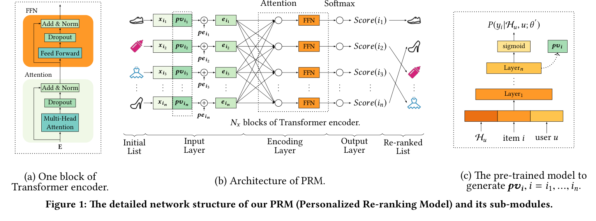
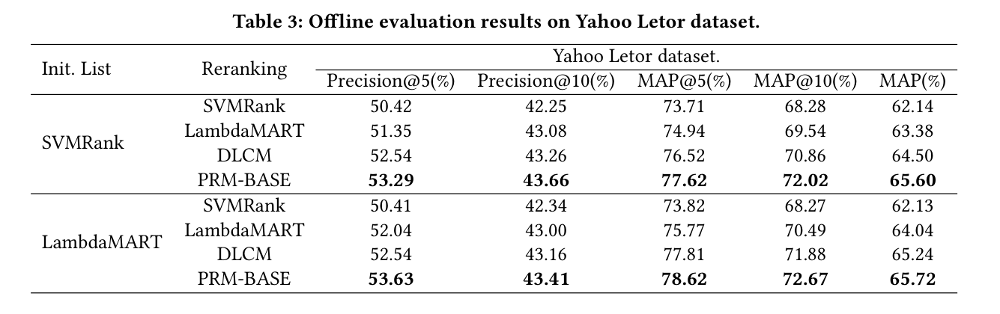
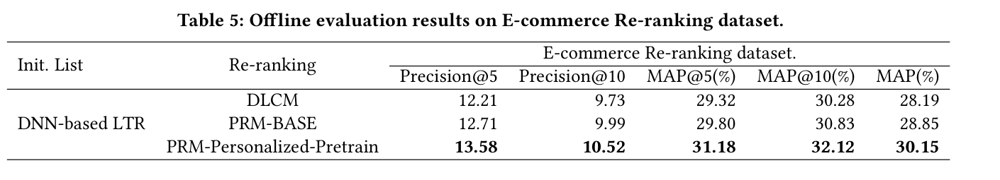

# Personalized Re-ranking for Recommendation

Changhua Pei, Yi Zhang, Yongfeng Zhang, Fei Sun, Xiao Lin, Hanxiao Sun, Jian Wu, Peng Jiang, Junfeng Ge, Wenwu Ou 
RecSys 2019 / Alibaba Group, Rutgers University, Kwai Inc.

> Transformer で初期推薦リスト全体を符号化し、事前学習したユーザー表現で re-ranking を個人化する。

---

## どんなもの？

- 前段 ranker が作った初期推薦リストを後段で並べ替える **Personalized Re-ranking Model（PRM）**
- 各アイテムを独立にスコアリングせず、リスト内の item-item interaction を見る
- Transformer encoder の self-attention で任意のアイテム対を直接結ぶ
- 事前学習 CTR モデルから personalized vector を取り、ユーザーごとの相互作用の効き方を変える

> Two-stage recommendation の 2 段目を、リスト全体最適化として扱う論文。

---

## 背景: なぜ reranker が必要か

- 実運用の推薦は候補生成 -> ranking -> re-ranking の多段構成になりやすい
- 通常の ranker は item 単体、または user-item pair を個別に評価する
- しかし表示リストでは、隣り合う item や似た item が互いに影響する
- ユーザーの意図によって、同じ item pair でも望ましい並びが変わる

> 最終表示リストでは「その item が良いか」だけでなく「どの item と一緒に、どの順で出すか」が重要。

---

## 課題: 既存手法は何を落とすか

- Pointwise / pairwise / listwise LTR は主に loss 設計でリスト性を扱う
- 特徴空間で item-item interaction を明示的に符号化しない
- RNN 系 reranker は遠い位置の情報が符号化距離で弱くなる
- Decoder で 1 件ずつ生成する手法はオンライン latency が厳しい
- 多くの reranker はユーザーごとの intent 差を直接入れない

> 実運用の reranker には、相互作用、個人化、低 latency の 3 つが同時に必要。

---

## 先行研究と比べてどこがすごい？

- DLCM / GlobalRerank のような RNN 系ではなく Transformer-like encoder を使う
- 任意の item pair を self-attention で O(1) distance に接続する
- Decoder 逐次生成を使わず、1-step scoring でオンライン向けにする
- 事前学習モデルの hidden vector を personalized vector として reranker に入れる
- オフライン公開 benchmark と実 EC オンライン A/B の両方で評価する

> 「リスト全体を見る」だけでなく、「誰にとってのリストか」まで入れた点が重要。

---

## 技術や手法のキモ

- Input: 初期リストの ranking features `X`
- Personalized Vector: ユーザー履歴・属性を使う事前学習モデルから `PV` を生成
- Position Embedding: 初期順位の position bias を入れる
- Encoding: Transformer encoder blocks で item-item interaction を符号化
- Output: 各 item の click probability を出し、リストを並べ替える

---

## Method: 入力から re-ranked list まで

| Step | 処理 | 目的 |
|---|---|---|
| 1 | 前段 ranker が `S = [i1, ..., in]` を作る | 候補を固定長リストにする |
| 2 | `x_i` と `pv_i` を concat | item feature と user intent を統合 |
| 3 | position embedding を加える | 初期順位情報を保持 |
| 4 | multi-head self-attention + FFN | item 間の相互影響を符号化 |
| 5 | softmax score を出す | 1-step で re-rank |

> Reranker は前段 ranker の特徴量をそのまま使える後段モジュールとして設計されている。

---

## 個人化モジュール

- PRM 内で `PV` を end-to-end に学習するだけでは、ユーザーの一般的嗜好が弱い
- プラットフォーム全体のクリックログで CTR 予測モデルを事前学習する
- 入力: ユーザー履歴 `H_u`、item、ユーザー属性
- 出力: click probability
- sigmoid 直前の hidden vector を `pv_i` として PRM に渡す

> 価格重視、カテゴリ比較、探索中など、item-item interaction の意味をユーザーごとに変える。

---

## どうやって有効だと検証した？

| Dataset | 内容 | 役割 |
|---|---|---|
| Yahoo Letor | 709,877 docs / 29,921 records | 公開 benchmark、user 情報なし |
| E-commerce Re-ranking | 743,720 users / 7,246,323 items / 14,350,968 records | 実 EC 由来、user 情報あり |

- Offline metrics: Precision@5, Precision@10, MAP@5, MAP@10, MAP
- Online metrics: PV, IPV, CTR, GMV
- Baselines: SVMRank, LambdaMART, DNN-based LTR, DLCM
- Seq2Slate / GlobalRerank は逐次 decoder の latency が重いため online baseline から除外

---

## Quantitative Results: Yahoo Letor

- PRM-BASE は personalized module なしの Transformer reranker
- SVMRank 初期リストで DLCM より MAP +1.10、Precision@5 +0.75
- LambdaMART 初期リストで DLCM より MAP +0.48、Precision@5 +1.09
- SVMRank / LambdaMART をもう一度かけるよりも安定して高い

> User 情報がない設定でも、Transformer による list encoding だけで改善する。

---

## Quantitative Results: E-commerce

- 初期リストは実システムの DNN-based LTR
- PRM-BASE は DLCM より MAP 28.19 -> 28.85
- PRM-Personalized-Pretrain は MAP 30.15 まで改善
- Precision@5 は 12.21 -> 12.71 -> 13.58

> 実 EC の難しい sparse click setting では、personalized vector の寄与が大きい。

---

## Online A/B Test

- DLCM でも re-ranking なし DNN-based LTR より online 指標が改善
- PRM-BASE は DLCM より PV と IPV をさらに伸ばす
- PRM-Personalized-Pretrain は GMV +6.65% を達成
- PRM-BASE から personalized module を足すと GMV が +6.29% absolute improvement

> オフライン MAP だけでなく、実運用の売上指標 GMV にも効いている。

---

## なぜ効くのか: Attention 可視化

- 類似カテゴリ間で attention weight が大きくなる
- electronics 系カテゴリ同士にも強い関係が出る
- 価格帯が近い item 同士で相互影響が大きい
- Position embedding ありでは、上位 item が下位 item へ強く影響する position bias も学習する

> Self-attention はランダムな重みではなく、カテゴリ・価格・位置に沿った意味のある相互作用を学んでいる。

---

## 議論・限界

- 強み: 前段 ranker の特徴量を再利用でき、後段モジュールとして入れやすい
- 強み: Transformer なので RNN より list encoding を並列化しやすい
- 強み: 事前学習モデルを差し替えられるため、実システムの CTR model と接続しやすい
- 限界: 多様性を直接目的関数に入れていない
- 限界: Seq2Slate / GlobalRerank は latency 理由で比較除外され、精度比較の範囲は限定される

> 産業実装向きだが、diversity-aware reranking との統合は今後の課題。

---

## 次に読むべき論文

- **Deep Neural Networks for YouTube Recommendations**: two-stage recommendation の古典
- **DLCM**: RNN/GRU 系の list context reranker
- **Seq2Slate**: slate optimization と sequential decoder の代表例
- **GlobalRerank**: attention decoder を使う re-ranking
- **Practical Diversified Recommendations on YouTube with DPP**: 多様性 reranking の実運用例

> PRM の次は、listwise neural reranking と diversity-aware reranking を並べて読むと位置づけが見える。

---

## まとめ

- PRM は前段 ranker の初期リストを Transformer で符号化する personalized reranker
- item-item interaction と user intent を同時に扱う点が、従来 RNN 系 reranker との差分
- Yahoo benchmark、EC dataset、オンライン A/B のすべてで改善を示した
- 特に実 EC では personalized vector が MAP と GMV の改善に効いている

> Two-stage recommendation の reranker を学ぶなら、実運用寄りの代表論文として読む価値が高い。
