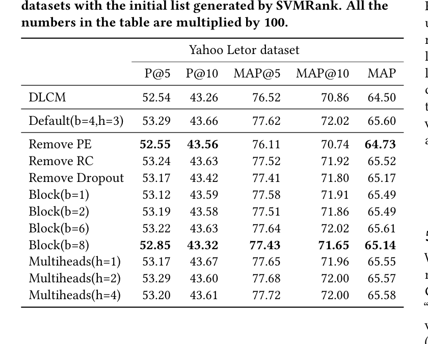
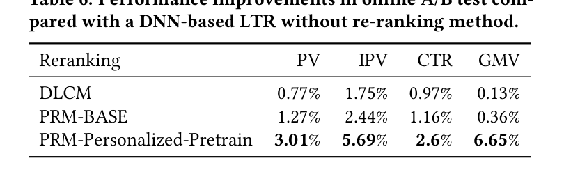
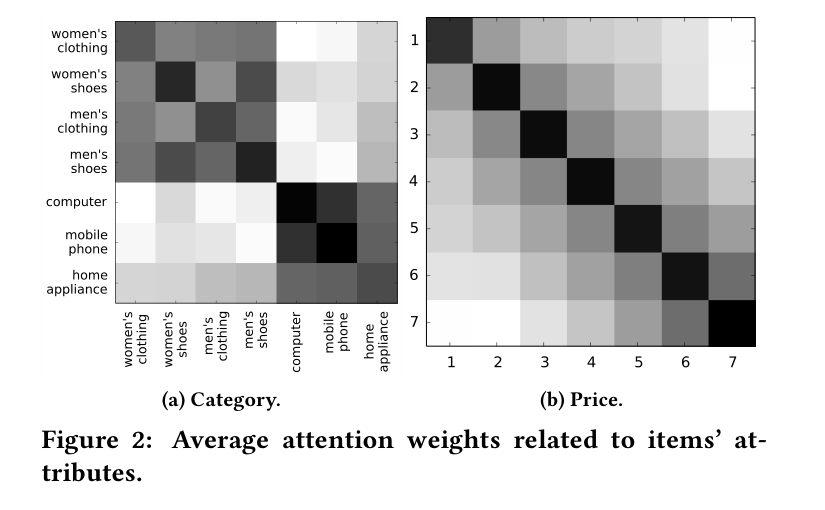
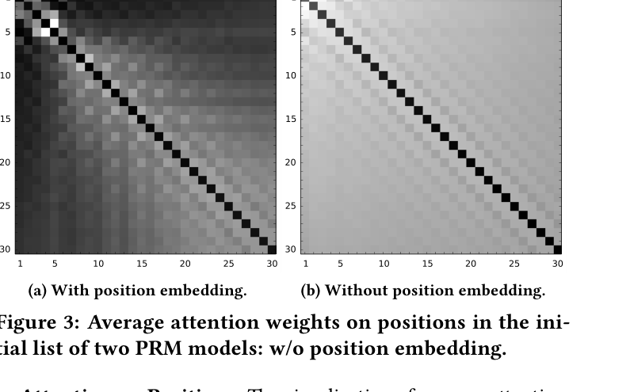

# Personalized Re-ranking for Recommendation

Changhua Pei, Yi Zhang, Yongfeng Zhang, Fei Sun, Xiao Lin, Hanxiao Sun, Jian Wu, Peng Jiang, Junfeng Ge, Wenwu Ou<br>
Alibaba Group / Rutgers University / Kwai Inc.<br>
RecSys '19, Copenhagen, Denmark, September 16-20, 2019<br>
DOI: 10.1145/3298689.3347000 / arXiv:1904.06813

## 概要

ランキングは推薦システムにおける中核的なタスクであり、ユーザーにアイテムの順序付きリストを提供することを目的とする。典型的には、ラベル付きデータセットからランキング関数を学習して全体性能を最適化し、各アイテムに対して個別のランキングスコアを生成する。しかし、この方法は各アイテムに個別にスコアリング関数を適用し、アイテム間の相互影響やユーザーの嗜好・意図の違いを明示的に考慮しないため、準最適になりうる。

そこで本論文では、推薦システムのための個人化 re-ranking モデルを提案する。提案する re-ranking モデルは、既存のランキング特徴ベクトルを直接利用することで、任意のランキングアルゴリズムの後段モジュールとして容易に導入できる。このモデルは Transformer 構造を用いて、リスト内の全アイテム情報を効率的に符号化し、推薦リスト全体を直接最適化する。具体的には、Transformer の self-attention 機構により、リスト全体に含まれる任意のアイテム対の大域的関係を直接モデル化する。

さらに、事前学習 embedding を導入してユーザーごとに異なる個人化符号化関数を学習することで、性能をさらに改善できることを確認した。オフライン benchmark と実世界のオンライン EC システムの両方における実験結果は、提案する re-ranking モデルが有意な改善をもたらすことを示している。

## 1. はじめに

ランキングは推薦システムで極めて重要である。ランキングアルゴリズムが与える順序付きリストの品質は、ユーザー満足度と推薦システムの収益に大きな影響を与える。ランキング性能を最適化するために、多数のランキングアルゴリズムが提案されてきた。通常、推薦システムにおけるランキングはユーザー-アイテム対の特徴のみを考慮し、リスト内の他のアイテム、特に隣接して配置されるアイテムからの影響を考慮しない。

pairwise および listwise の learning to rank 手法は、アイテム対またはアイテムリストを入力に取ることでこの問題に取り組もうとしている。しかし、それらは主にクリックデータなどのラベルをよりよく利用するために損失関数を最適化することに焦点を置いており、特徴空間におけるアイテム間の相互影響を明示的にはモデル化していない。

一部の研究は、既存のランキングアルゴリズムによって与えられた初期リストを洗練するため、アイテム間の相互影響を明示的にモデル化する。この処理は re-ranking と呼ばれる。基本的な考え方は、アイテム内・アイテム間のパターンを特徴空間へ符号化することにより、スコアリング関数を構築することである。特徴ベクトルを符号化する従来の state-of-the-art 手法は、GlobalRerank や DLCM のような RNN ベースの手法である。これらは初期リストを RNN 構造へ逐次的に入力し、各時刻で符号化ベクトルを出力する。

しかし、RNN ベースの手法は、リスト内アイテム間の相互作用をモデル化する能力に制限がある。先に符号化されたアイテムの特徴情報は、符号化距離が長くなるにつれて劣化する。機械翻訳で用いられた Transformer アーキテクチャに着想を得て、本論文ではアイテム間の相互影響をモデル化するために Transformer を用いる。Transformer は self-attention 機構を用いるため、任意の 2 アイテムが符号化距離による劣化なしに直接相互作用できる。また、Transformer の符号化処理は並列化できるため、RNN ベース手法より効率的である。

アイテム間相互作用に加えて、推薦システムの re-ranking では、相互作用を符号化する関数も個人化されるべきである。推薦システムにおける re-ranking はユーザー固有であり、ユーザーの嗜好や意図に依存する。例えば価格に敏感なユーザーに対しては、価格特徴の相互作用が re-ranking モデルでより重要になるべきである。典型的な大域的符号化関数は、ユーザーごとの特徴分布の違いを無視するため、最適ではない可能性がある。

例えば、ユーザーが価格比較に注目しているとき、異なる価格を持つ類似アイテムはリスト内でより集約される傾向がある。一方、ユーザーに明確な購買意図がないときは、推薦リスト内のアイテムはより多様になる傾向がある。そこで本論文では、Transformer 構造へ個人化モジュールを導入し、アイテム相互作用に対するユーザーの嗜好と意図を表現する。リスト内アイテムとユーザーの相互作用は、提案する個人化 re-ranking モデルで同時に捉えられる。

本論文の主な貢献は以下である。

- **問題設定**: 推薦システムにおける個人化 re-ranking 問題を提案する。著者らの知る限り、大規模オンラインシステムの re-ranking タスクへ個人化情報を明示的に導入した初めての研究である。実験結果は、ユーザー表現を re-ranking のリスト表現へ導入する有効性を示す。
- **モデル**: 個人化 embedding を備えた Transformer を用いて、初期ランキングリストの表現を計算し、re-ranking スコアを出力する。self-attention 機構により、任意の 2 アイテム間のユーザー固有な相互影響を、RNN ベース手法より効果的かつ効率的にモデル化できる。
- **データ**: 本論文で用いた大規模データセット E-commerce Re-ranking dataset を公開する。このデータセットは実世界の EC 推薦システムから構築され、クリックラベルとランキング特徴を持つユーザー向け推薦リストを含む。
- **評価**: オフライン実験とオンライン実験の両方により、提案手法が state-of-the-art 手法を有意に上回ることを示す。オンライン A/B テストでは、実世界システムでクリック率と収益の向上を示す。

## 2. 関連研究

本研究は、base ranker が与える初期ランキングリストを洗練することを目的とする。base ranker の中で、learning to rank は広く用いられる方法の一つである。learning to rank 手法は、用いる損失関数に応じて pointwise、pairwise、listwise の 3 種類に分類できる。これらの手法は、ある特徴の重みを大域的に学習するグローバルなスコアリング関数を学習する。しかし、特徴の重みはアイテム間だけでなく、ユーザーとアイテムの相互作用にも応じるべきである。

本研究に最も近いのは re-ranking 手法である。これらは初期リスト全体を入力に取り、異なる方法でアイテム間の複雑な依存関係をモデル化する。DLCM は一方向 GRU を用いてリスト全体の情報を各アイテム表現へ符号化する。GlobalRerank は LSTM を用い、Seq2Slate は pointer network を用いて、リスト全体の情報を符号化するだけでなく、decoder によりランキングリストを生成する。

GRU や LSTM によってアイテム依存関係を符号化する手法では、encoder の能力が符号化距離に制限される。本論文では、self-attention 機構に基づく Transformer-like encoder を用い、任意の 2 アイテム間の相互作用を O(1) の距離でモデル化する。さらに、decoder により順次的に順序付きリストを生成する手法は、厳しい latency 条件を持つオンラインランキングシステムには適さない。時刻 t のアイテム選択に時刻 t-1 で選ばれたアイテムを入力として用いるため並列化できず、出力リスト長 n に対して n 回の inference が必要になる。

## 3. Re-ranking モデルの定式化

本節では、推薦システムにおける learning to rank と re-ranking の予備知識を述べ、対象とする問題を定式化する。

### 表1. 本論文で用いる記法

| 記法 | 説明 |
|---|---|
| `X` | 特徴行列 |
| `PV` | 個人化ベクトル行列 |
| `PE` | 位置 embedding 行列 |
| `E` | 入力層の出力行列 |
| `R` | 全ユーザーリクエスト集合 |
| `I_r` | ユーザーリクエスト `r in R` に対する候補アイテム集合 |
| `S_r` | ユーザーリクエスト `r` に対してランキング手法が生成した初期アイテムリスト |
| `H_u` | ユーザー `u` がクリックしたアイテム系列 |
| `theta, hat(theta), theta'` | ランキング、re-ranking、事前学習モデルのパラメータ行列 |
| `y_i` | アイテム `i` のクリックラベル |
| `P(y_i)` | モデルが予測したアイテム `i` のクリック確率 |

learning to rank（LTR）は、実世界システムにおいて、情報検索や推薦の順序付きリストを生成するため広く用いられる。LTR は、アイテムの特徴ベクトルに基づく大域的なスコアリング関数を学習する。この関数により、候補集合内の各アイテムをスコアリングして順序付きリストを出力する。通常、このスコアリング関数は次の損失関数 `L` を最小化することで学習される。

```text
L = sum_{r in R} l({ y_i, P(y_i | x_i; theta) }_{i in I_r})
```

ここで `R` は推薦に対する全ユーザーリクエスト集合、`I_r` はリクエスト `r` に対する候補アイテム集合である。`x_i` はアイテム `i` の特徴空間、`y_i` はアイテム `i` のラベル、すなわちクリックされたか否かを表す。`P(y_i | x_i; theta)` は、パラメータ `theta` を持つランキングモデルが予測するアイテム `i` のクリック確率である。

しかし、良いスコアリング関数を学習するには `x_i` だけでは十分ではない。推薦システムにおけるランキングでは、次の追加情報を考慮すべきである。

- アイテム対の相互影響
- ユーザーとアイテムの相互作用

アイテム対の相互影響は、既存の LTR モデルがリクエスト `r` に対して与える初期リスト `S_r = [i_1, i_2, ..., i_n]` から直接学習できる。既存研究はアイテム対の相互情報をよりよく利用する方法を提案してきたが、ユーザーとアイテムの相互作用を考慮する研究は少ない。アイテム対の相互影響の程度はユーザーごとに異なる。本論文では、個人化行列 `PV` を導入し、アイテム対の個人化された相互影響をモデル化できるユーザー固有の符号化関数を学習する。

```text
L = sum_{r in R} l({ y_i, P(y_i | X, PV; hat(theta)) }_{i in S_r})
```

ここで `S_r` は前段のランキングモデルが与える初期リスト、`hat(theta)` は re-ranking モデルのパラメータ、`X` はリスト内全アイテムの特徴行列である。

## 4. Personalized Re-ranking Model

本節では、提案する Personalized Re-ranking Model（PRM）の概要を示し、各構成要素を説明する。

### 4.1 モデルアーキテクチャ

PRM の構造を図1に示す。モデルは input layer、encoding layer、output layer の 3 つから構成される。前段のランキング手法が生成したアイテム初期リストを入力とし、re-ranked list を出力する。


### 4.2 入力層

入力層の目的は、初期リスト内の全アイテムについて包括的な表現を準備し、encoding layer へ渡すことである。まず、前段ランキング手法が与える固定長の初期系列リスト `S = [i_1, i_2, ..., i_n]` がある。前段ランキング手法と同様に、生の特徴行列 `X in R^{n x d_feature}` を持つ。`X` の各行は、`S` 内の各アイテム `i` に対応する生特徴ベクトル `x_i` を表す。

**Personalized Vector（PV）**: 2 つのアイテムの特徴ベクトルを符号化することで、それらの相互影響をモデル化できる。しかし、その影響がユーザーにどの程度作用するかは不明である。そこで、ユーザー固有の符号化関数を学習する必要がある。初期リスト全体の表現はユーザー嗜好を部分的に反映するが、強力な個人化符号化関数には不十分である。PRM では、生特徴行列 `X` と個人化行列 `PV in R^{n x d_pv}` を連結して中間 embedding 行列を得る。

```text
E = [x_{i_1}; pv_{i_1}], [x_{i_2}; pv_{i_2}], ..., [x_{i_n}; pv_{i_n}]
```

`PV` は後述する事前学習モデルによって生成される。

**Position Embedding（PE）**: 初期リストの系列情報を利用するため、入力 embedding に position embedding `PE` を注入する。本論文では learnable PE を用いる。著者らの実験では、Transformer 原論文で用いられた固定 position embedding よりわずかに良い性能を示した。

最後に、単純な feed-forward network を用いて、特徴行列 `E in R^{n x (d_feature + d_pv)}` を `E in R^{n x d}` へ変換する。ここで `d` は encoding layer の各入力ベクトルの潜在次元数である。

### 4.3 符号化層

符号化層の目的は、アイテム対の相互影響、ユーザー嗜好、初期リスト `S` のランキング順序を含む追加情報を統合することである。そのため、PRM は Transformer-like encoder を採用する。Transformer は多くの NLP タスク、特に機械翻訳で有効性が示されており、RNN ベース手法に比べて強力な符号化・復号能力を持つ。

Transformer の self-attention 機構は、距離にかかわらず任意の 2 アイテムの相互影響を直接モデル化するため、re-ranking タスクに特に適している。距離減衰がないため、Transformer は初期リスト内で互いに離れたアイテム間の相互作用も捉えられる。

attention 関数は次のように定義される。

```text
Attention(Q, K, V) = softmax(Q K^T / sqrt(d)) V
```

ここで `Q, K, V` は query、key、value 行列であり、`d` は内積値が過大になることを避けるための `K` の次元数である。本論文では self-attention を用いるため、`Q, K, V` は同じ行列から射影される。

より複雑な相互影響をモデル化するため、multi-head attention を用いる。

```text
MH(E) = Concat(head_1, ..., head_h) W^O
head_i = Attention(E W^Q, E W^K, E W^V)
```

各 Transformer encoder block は attention layer と position-wise Feed-Forward Network（FFN）層から構成される。複数 block を積み重ねることで、より複雑で高次の相互情報を獲得できる。

### 4.4 出力層

出力層の役割は、各アイテム `i in {i_1, ..., i_n}` に対してスコア `Score(i)` を生成することである。PRM は softmax 層の前に線形層を 1 つ用いる。softmax 層の出力は各アイテムのクリック確率であり、`P(y_i | X, PV; hat(theta))` と表される。これを `Score(i)` として用い、1-step でアイテムを re-rank する。

```text
Score(i) = P(y_i | X, PV; hat(theta))
         = softmax(F(N_x) W^F + b^F), i in S_r
```

ここで `F(N_x)` は `N_x` 個の Transformer encoder block の出力であり、`W^F` は学習可能な射影行列、`b^F` はバイアス項である。訓練ではクリックデータをラベルとして用い、負の対数尤度損失を最小化する。

```text
L = - sum_{r in R} sum_{i in S_r} y_i log(P(y_i | X, PV; hat(theta)))
```

### 4.5 個人化モジュール

本節では、ユーザーとアイテムの相互作用を表す個人化行列 `PV` の計算方法を説明する。直感的には、`PV` を PRM モデル内で re-ranking loss により end-to-end に学習することもできる。しかし、re-ranking タスクは前段ランキング手法の出力を洗練するタスクであるため、re-ranking タスクだけで学習された表現は、ユーザーの汎用的な嗜好を十分に含まない。

そこで PRM では、ユーザーの個人化 embedding `PV` を生成する事前学習 neural network を利用し、PRM の追加特徴として使用する。事前学習 neural network は、プラットフォーム全体のクリックログから学習される。このモデルは、ユーザー `u` の全行動履歴 `H_u` とユーザーの side information が与えられたとき、アイテム `i` に対するクリック確率 `P(y_i | H_u, u; theta')` を出力する。ユーザーの side information には性別、年齢、購買レベルなどが含まれる。

事前学習モデルの損失は pointwise cross entropy により計算される。

```text
L = sum_{i in D} [ y_i log(P(y_i | H_u, u; theta'))
    + (1 - y_i) log(1 - P(y_i | H_u, u; theta')) ]
```

ここで `D` はプラットフォーム上でユーザー `u` に表示されたアイテム集合である。著者らは sigmoid 層の前の hidden vector を、PRM に入力する個人化ベクトル `pv_i` として用いる。事前学習モデルの構造は PRM と強く結合しているわけではなく、FM、FFM、DeepFM、DCN、FNN、PNN などの一般的なモデルも `PV` 生成の代替として利用できる。

## 5. 実験結果

本節では、評価に用いたデータセットと baseline を説明し、提案手法を baseline と比較する。同時に、PRM のどの部分が性能に寄与しているかを理解するために ablation study を行う。

### 5.1 データセット

評価には 2 つのデータセットを用いる。Yahoo! Webscope v2.0 set 11（以下 Yahoo Letor dataset）と、E-commerce Re-ranking dataset である。著者らの知る限り、推薦の文脈情報を持つ公開 re-ranking dataset は存在しないため、人気 EC プラットフォームから E-commerce Re-ranking dataset を構築した。

### 表2. データセット概要

| 項目 | Yahoo Letor Dataset | E-commerce Re-ranking Dataset |
|---|---:|---:|
| Users | - | 743,720 |
| Docs/Items | 709,877 | 7,246,323 |
| Records | 29,921 | 14,350,968 |
| Relevance/Feedback | {0,1,2,3,4} | {0,1} |

Yahoo Letor dataset は、Seq2Slate と同じ方法で推薦のランキングモデルに適合するよう処理する。まず、評価値 0 から 4 をしきい値 `T_b` により binary label へ変換する。次に、アイテムの impression probability をシミュレートするため decay factor `eta` を用いる。実世界の推薦では、アイテムはユーザーに上から下へ見られる。モバイルアプリの画面には限られた数のアイテムしか表示できないため、順位が下がるほど閲覧確率は小さくなる。本論文では、`1 / pos(i)^eta` を decay probability として用いる。

E-commerce Re-ranking dataset は、実世界推薦システムから得られたクリックログ形式の大規模レコードを含む。各レコードは、ユーザーの基本情報、クリックラベル、ランキング用の生特徴を持つ推薦リストである。

### 5.2 Baselines

baseline として learning to rank（LTR）手法と re-ranking 手法を用いる。

LTR 手法は 2 つの役割で用いられる。第一に、各ユーザーリクエスト `r` の候補集合 `I_r` から re-ranking モデル用の初期リスト `S_r` を生成する。第二に、pairwise または listwise loss を用いる LTR 手法は、初期リスト `S_r` を入力として再度ランキングを実行することで re-ranking 手法としても使える。本論文で用いる代表的 LTR は SVMRank、LambdaMART、DNN-based LTR である。DNN-based LTR は、実際のオンライン推薦システムに導入されている Wide&Deep 構造を pointwise loss で学習するモデルである。

re-ranking 手法としては DLCM を baseline に用いる。Seq2Slate と GlobalRerank は decoder 構造により re-ranked list を逐次生成するため、オンライン inference で並列化できず、厳しい latency 条件を持つオンライン推薦サービスでは許容できない。そのため baseline から除外する。

### 5.3 評価指標

オフライン評価では Precision と MAP を用いる。具体的には Precision@5、Precision@10、MAP@5、MAP@10、MAP@30 を用いる。実験における初期リストの最大長は 30 であるため、MAP@30 は全体 MAP を表し、本論文では MAP と表記される。

オンライン A/B テストでは PV、IPV、CTR、GMV を用いる。PV と IPV は、ユーザーが閲覧したアイテム総数とクリックしたアイテム総数として定義される。CTR は `IPV / PV` で計算されるクリック率である。GMV は推薦アイテムに対してユーザーが支払った総金額、すなわち revenue を表す。

### 5.4 実験設定

baseline と PRM モデルの双方で、重要な hyperparameter には同じ値を用いる。hidden dimensionality `d_model` は Yahoo Letor dataset で 1024、E-commerce Re-ranking dataset で 64 とする。PRM の Adam optimizer の learning rate は Transformer 論文と同じ設定を用いる。損失関数には負の対数尤度を用い、dropout probability は 0.1 とする。batch size は Yahoo Letor dataset で 256、E-commerce Re-ranking dataset で 512 とする。

### 5.5 オフライン実験

#### 5.5.1 Yahoo Letor dataset における評価

本節では、Yahoo Letor dataset 上で以下の問いを検証する。

- RQ0: PRM は state-of-the-art 手法を上回るか。また、その理由は何か。
- RQ1: 異なる LTR 手法が生成した初期リストに応じて性能は変化するか。


表3では、SVMRank と LambdaMART がそれぞれ生成した 2 種類の初期リストに基づいて baseline と PRM-BASE を比較する。PRM-BASE は個人化モジュールを持たない PRM の variant である。Yahoo Letor dataset にはユーザー関連情報がないため、比較には PRM-BASE のみを用いる。

表3は、PRM-BASE がすべての baseline に対して安定して有意な性能改善を達成することを示す。SVMRank により生成された初期リストを用いた場合、PRM-BASE は DLCM に対して MAP で 1.7、Precision@5 で 1.4 上回る。SVMRank と比較すると、MAP で 5.6、Precision@5 で 5.7 の改善となる。LambdaMART による初期リストを用いた場合も、PRM-BASE は DLCM に対して MAP で 0.7、Precision@5 で 2.1 上回る。

PRM-BASE は DLCM と同じ訓練データを用い、個人化モジュールを含まない。したがって DLCM に対する性能向上は、主に Transformer の強力な符号化能力に由来する。multi-head attention 機構は、特に符号化リストが長い場合に、任意のアイテム対の相互影響を O(1) の符号化距離でモデル化できる。



表4は、position embedding を削除すると性能が大きく低下することを示す。これは初期リストで与えられる系列情報の重要性を確認するものである。position embedding を削除すると、モデルは順序付きリストではなく候補集合からスコアリング関数を学習することになる。ただし、position embedding なしでも PRM-BASE は DLCM と同等の性能を達成しており、PRM-BASE が初期リストを DLCM より効果的に符号化できることを示す。

residual connection と dropout layer を削除した場合、MAP はそれぞれ 0.1 と 0.7 程度低下する。block 数を 1、2、4 と増やすと性能は上がるが、6、8 とさらに積むと過学習により低下する。multi-head attention の head 数については大きな改善は観察されず、計算コストを節約するため head 数は 1 でもよいと著者らは述べている。

#### 5.5.2 E-commerce Re-ranking dataset における評価

本節では、以下の問いを検証する。

- RQ2: 個人化モジュールを備えた PRM はどの程度の性能を示すか。


E-commerce Re-ranking dataset では、PRM-BASE に加えて、事前学習された personalized vector `PV` を備えた PRM-Personalized-Pretrain を評価する。初期リストは、実世界推薦システムで導入されている DNN-based LTR により生成される。

表5は、PRM-BASE と DLCM の比較において表3と一貫した結果を示す。PRM-BASE は DLCM に対して MAP で 2.3、Precision@5 で 4.1 上回る。Yahoo Letor dataset では PRM-BASE の改善が MAP で 1.7、Precision@5 で 1.4 であったことを考えると、E-commerce Re-ranking dataset での改善はより大きい。

この差はデータセット特性と強く関係する。Yahoo Letor dataset の平均 click-through rate は 30% であり、30 件の推薦ドキュメントのうち約 9 件がクリックされる。一方、実世界の E-commerce Re-ranking dataset の平均 click-through rate は 5% 以下である。つまり Yahoo Letor dataset のランキングは EC re-ranking dataset より容易である。著者らは、ランキングタスクが難しいほど PRM の改善幅が大きいことを観察している。

表5はまた、PRM-Personalized-Pretrain が PRM-BASE に対して有意な改善を達成することを示す。PRM-Personalized-Pretrain は PRM-BASE を MAP で 4.5、Precision@5 で 6.8 上回る。これは主に事前学習モデルから得られる personalized vector `PV` によるものである。事前学習モデルは長期間のユーザーログを十分に活用し、より汎用的で代表的なユーザー嗜好 embedding を提供できる。また、長期的で汎用的なユーザー embedding により、PRM はユーザー固有の符号化関数をよりよく学習し、各ユーザーに対するアイテム対の相互影響をより精密に捉えられる。

### 5.6 オンライン実験

実世界 EC 推薦システムでオンライン A/B テストを行い、PV、IPV、CTR、GMV を評価する。各アルゴリズムについて、数十万ユーザーと数百万リクエストをオンラインテストに用いる。



表6は、DNN-based LTR を用いたオンライン base ranker に対する 3 手法の相対改善を示す。第一に、どの re-ranking 手法でもオンライン指標が向上しており、re-ranking が初期リスト内アイテムの相互影響を考慮することで性能を改善することが分かる。DLCM による PV の 0.77% 改善は、著者らのオンラインシステムでは有意であり、re-ranking により数十億規模の追加アイテム閲覧が生じることを意味する。

第二に、PRM-BASE は DLCM に比べて、閲覧アイテムで 0.50% の絶対改善、クリックアイテムで 0.69% の絶対改善をもたらす。最後に、個人化モジュールを用いる PRM-Personalized-Pretrain は、PRM-BASE に比べて GMV をさらに 6.29% 絶対改善する。オフライン実験で PRM-Personalized-Pretrain が PRM-BASE に対して MAP で 4.5% 改善したことを踏まえると、事前学習ユーザー表現による個人化符号化関数が、より精密なアイテム対相互作用を捉え、re-ranking に大きな性能向上をもたらすことを示している。

### 5.7 Attention weight の可視化

本節では、学習された attention weight を可視化し、以下の問いを検証する。

- RQ3: self-attention 機構は、位置やアイテム特性などの異なる側面に関して意味のある情報を学習できるか。



**属性への attention**: 著者らは、category と price の 2 つの特性に関して、アイテム間の平均 attention weight を可視化する。図2の各 heatmap block は、7 つの主要カテゴリに属するアイテム間の平均 attention weight を表す。濃い block ほど weight が大きい。図2(a) から、attention 機構が異なるカテゴリにおける相互影響を捉えられることが分かる。類似カテゴリのアイテムはより大きな attention weight を持つ傾向があり、より大きな相互影響を示す。例えば men's shoes は computer より women's shoes に大きな影響を持つ。computer、mobile phone、home appliance が互いに大きな attention weight を持つことも理解しやすい。これらはいずれも electronics である。図2(b) では価格を 7 段階に分類しており、価格が近いアイテムほど相互影響が大きいことが示される。



**位置への attention**: 図3は、初期リスト内の異なる位置に対する平均 attention weight を示す。図3(a) は、提案モデルの self-attention 機構が符号化距離にかかわらず相互影響を捉え、推薦リストの position bias も捉えられることを示す。リスト上位にあるアイテムはクリックされやすく、リスト末尾のアイテムにより大きな影響を与える。例えば、1 位のアイテムは、距離としては 26 位のアイテムの方が 30 位に近いにもかかわらず、30 位のアイテムに対して 26 位のアイテムより大きな影響を持つことが観察される。図3(b) と比較すると、position embedding の効果も明らかであり、position embedding がない場合には各位置間の attention weight がより一様に分布する。

## 6. 結論と今後の課題

本論文では、state-of-the-art の learning to rank 手法が与える初期リストを洗練するための個人化 re-ranking model（PRM）を提案した。re-ranking モデルでは Transformer network を用い、アイテム間依存関係とユーザー-アイテム間相互作用の両方を符号化する。personalized vector は re-ranking モデルにさらなる性能改善をもたらす。

オンラインおよびオフライン実験の両方により、PRM が公開 benchmark dataset と公開された実世界 dataset の双方でランキング性能を大きく改善することが示された。公開された実世界 dataset は、推薦システムにおける ranking/re-ranking アルゴリズム研究を可能にする。

本研究は特徴空間における複雑な item-item relationship を明示的にモデル化する。一方で、label space における最適化も有用である可能性がある。今後の方向性として、re-ranking による多様化の学習が挙げられる。提案モデルは実運用上 ranking diversity を損なわないが、多様化の目標を re-ranking モデルへ導入することは試す価値がある。著者らは今後この方向をさらに探索すると述べている。

## 参考文献

参考文献の詳細は原論文を参照。主要な関連論文として、DLCM、Seq2Slate、GlobalRerank、Transformer、Wide&Deep、DeepFM、DCN、SVMRank、LambdaMART、Learning to Rank for Information Retrieval が引用されている。

## 抽出メモ

- PDF は text-based として抽出された。
- 本文抽出では 2 段組レイアウトのため一部の節順が崩れたため、ページ画像を参照して節順を補正した。
- 主要図表は、PDF ページレンダリングから読みやすい PNG として再切り出しした。
