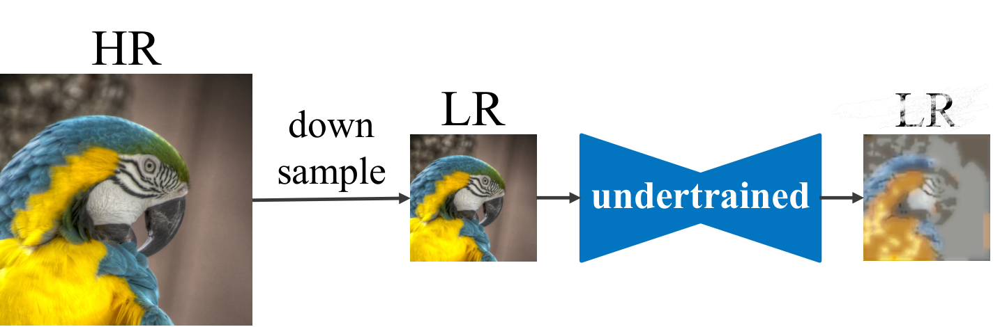
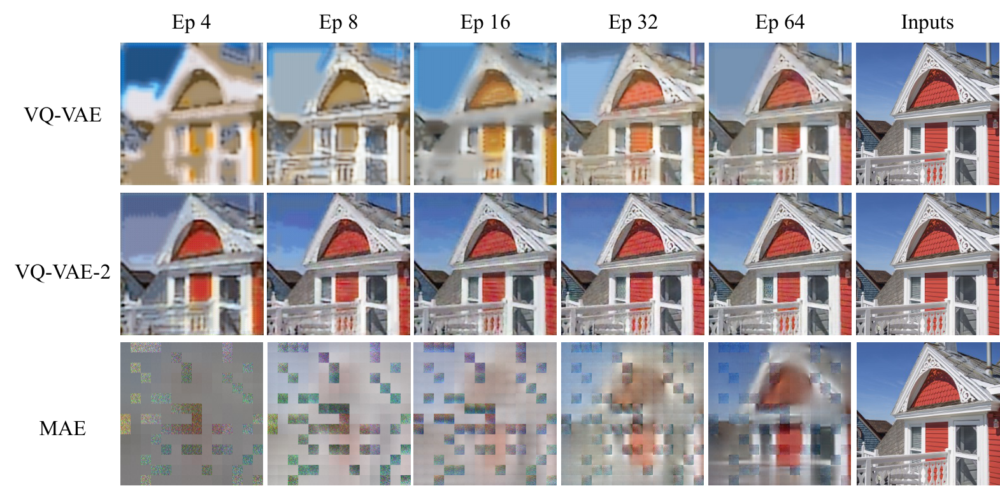
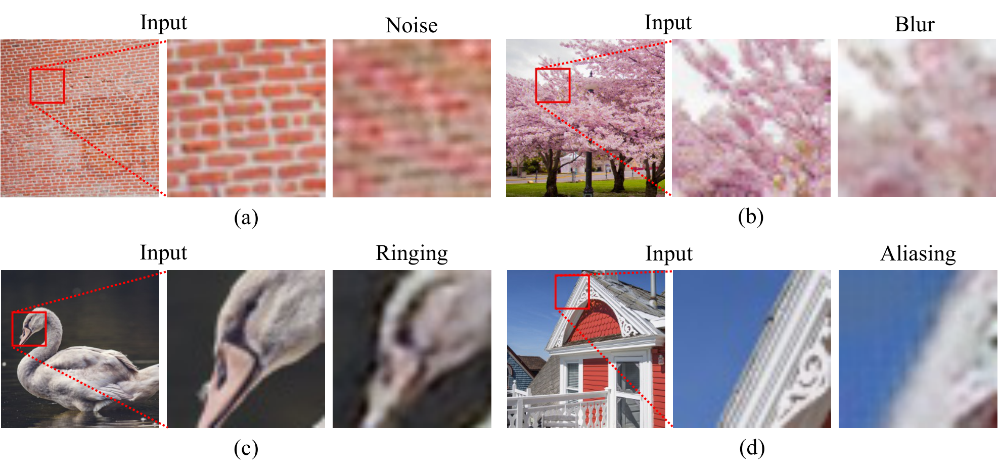
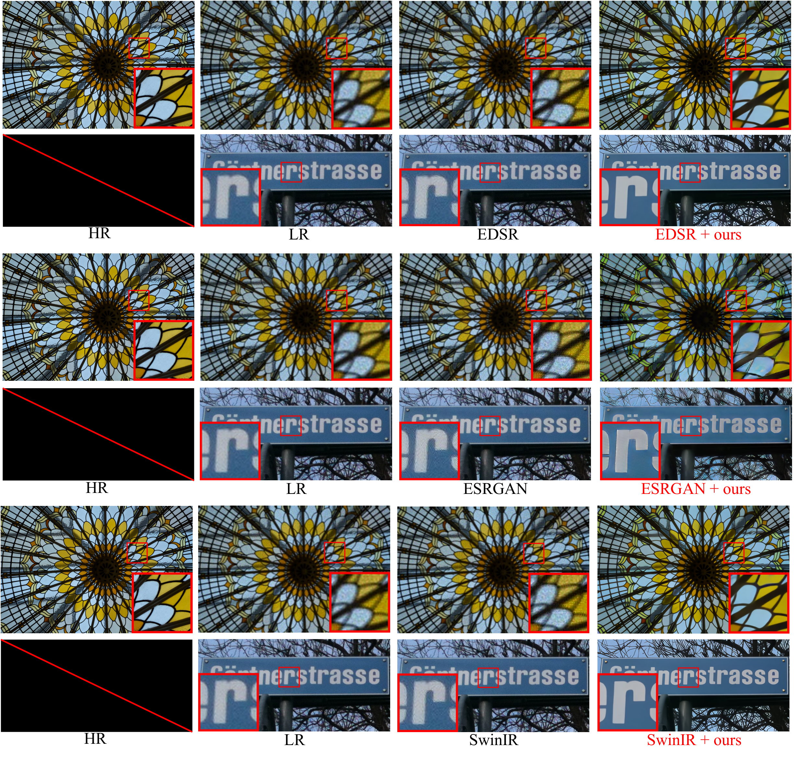
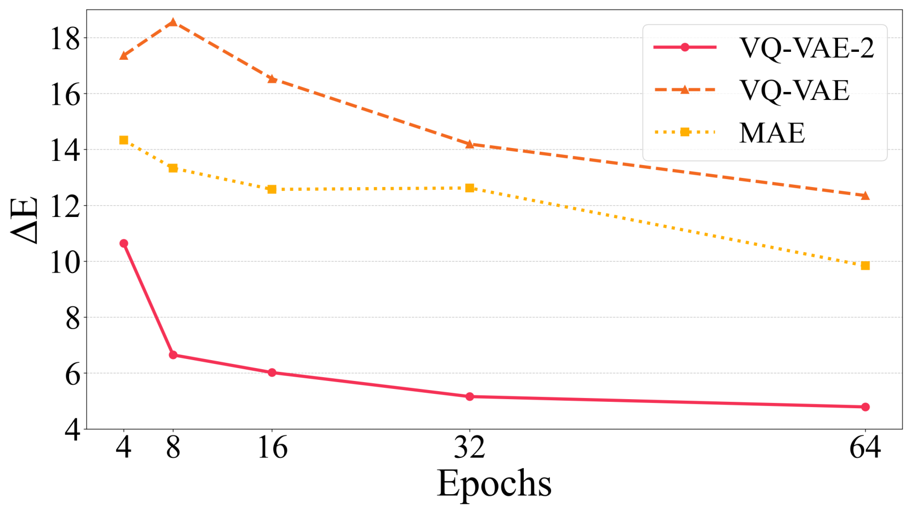

# Undertrained Image Reconstruction for Realistic Degradation in Blind Image Super-Resolution

Ru Ito, Supatta Viriyavisuthisakul, Kazuhiko Kawamoto, Hiroshi Kera  
arXiv:2503.02767 / 2025

> 未学習不足な画像再構成モデルを「劣化生成器」として使い、現実世界 LR 画像に強い超解像モデルへ fine-tuning する論文。

---

## どんなもの？

- Blind image super-resolution 向けの **データセット生成手法**
- HR 画像だけから、現実世界っぽい多様な劣化をもつ LR 画像を作る
- 生成した HR-LR ペアで既存 SR モデルを fine-tuning する
- 新しい SR アーキテクチャではなく、**学習データ側を改善する**アプローチ

> キモは「未学習不足な再構成モデルの出力は低品質だが、その低品質さを現実的な劣化として利用する」こと。

---

## 背景: なぜ現実世界 LR は難しいか

- 多くの SR モデルは HR 画像を bicubic などで downsample した合成 LR で訓練される
- 合成 LR の劣化は単純: 主に縮小によるぼけ
- 現実世界 LR は撮像過程、ノイズ、ぼけ、JPEG 圧縮、ringing などが混ざる
- そのため、合成データで最適化された SR モデルは現実世界 LR で性能が落ちる

> 問題の本質は、訓練データの劣化分布と実世界入力の劣化分布がずれていること。

---

## 課題: 既存のデータセット構築は何が難しいか

- 実機で HR-LR ペアを撮る方法は高コスト
- RealSR / DRealSR などは数百シーン規模で、シーン多様性が制限される
- 既存の疑似劣化生成は、実世界劣化の一部しか再現しない
- GAN ベースの劣化生成は訓練が不安定になりやすい

| 方向性 | 強み | 弱み |
|---|---|---|
| 実機収集 | 現実的な HR-LR ペア | 高コスト・シーン数が少ない |
| 推定劣化の適用 | HR 画像を多く使える | 劣化種類が限定的 |
| GAN 劣化生成 | 分布を学習できる | 不安定・破綻の可能性 |

---

## 先行研究と比べてどこがすごい？

- HR 画像だけでデータセット生成できる
- 実機撮影や real LR 画像の劣化推定に依存しない
- VQ-VAE-2 などの画像再構成モデルを「十分に訓練しない」ことを利用する
- 既存の SR モデルをそのまま fine-tuning できるため model-agnostic

> 先行研究が「劣化を正確に推定・学習する」方向だったのに対し、この論文は「未学習不足による自然な再構成失敗」を劣化源として使う。

---

## 技術や手法のキモ

::: two-col

### 発想

- 画像再構成モデルを少ない epoch で止める
- 入力構造はある程度保つ
- ただしノイズ、ぼけ、aliasing、ringing などが混ざる
- その出力を LR 画像として使う

### 生成されるペア

1. HR 画像 `y` を downsample して LR `x` を作る
2. 未学習不足モデル `Gθ` に `x` を入れる
3. 劣化 LR `x_deg` を得る
4. `(x_deg, y)` を訓練ペアにする

:::

> 未学習不足は普通は失敗だが、この論文では「多様な劣化を出す性質」として再利用する。

---

## 提案手法のパイプライン

- データセットは `D = {(x_deg^i, y^i)}`
- fine-tuning 対象は既存の事前学習済み SR モデル
- 手法自体は SR モデルの構造を変更しない

---

## どの再構成モデルを使うか

- 予備実験で 5 種類を比較
- VanillaVAE / DDIM は入力から大きく外れ、再構成品質が低すぎる
- MAE は epoch が進むと構造と色をある程度保持
- VQ-VAE / VQ-VAE-2 は少ない訓練でも構造を保ちつつ劣化を入れられる

| モデル | 判断 |
|---|---|
| VanillaVAE | 表現能力不足で不採用 |
| DDIM | reverse process が不安定で不採用 |
| VQ-VAE | 採用 |
| VQ-VAE-2 | 採用、最も有効 |
| MAE | 採用、ただし色差が課題 |

---

## 生成データセットは何を含むか

- DF2K の HR 画像を 1,024 x 1,024 に crop
- 約 20,000 枚を scale factor 4 で downsample
- VQ-VAE / VQ-VAE-2 / MAE で劣化 LR を生成

---

## 劣化の具体例

- ノイズ: レンガの色が赤・緑に揺れる
- ぼけ: 桜の輪郭が不鮮明になる
- ringing: アヒルの頭部周辺にリング状アーティファクト
- aliasing: 屋根の直線に jagged edge

> 現実世界 LR 画像で起きる複数種類の劣化を、単一の生成手順から得ている。

---

## どうやって有効だと検証した？

- 生成データセットで事前学習済み SR モデルを fine-tuning
- 評価ベンチマーク: NTIRE2018 Track 3, NTIRE2020 Track 2
- 対象モデル: HAT, EDSR, ESRGAN, SwinIR
- 指標: PSNR ↑, SSIM ↑, LPIPS ↓

| 検証軸 | 内容 |
|---|---|
| データセット有効性 | HAT を VQ-VAE / VQ-VAE-2 / MAE 生成データで fine-tuning |
| 汎用性 | EDSR / ESRGAN / SwinIR にも適用 |
| 劣化分析 | entropy で劣化多様性を評価 |
| 失敗要因分析 | 色差 ΔE と性能低下の関係を評価 |

---

## 定量評価: HAT での主結果

| 生成モデル | Dataset | PSNR ↑ | SSIM ↑ | LPIPS ↓ |
|---|---:|---:|---:|---:|
| w/o fine-tune | - | 18.24 | 0.4337 | 0.6272 |
| VQ-VAE-2 | Ep 4 | 16.68 | 0.5077 | 0.6386 |
| VQ-VAE-2 | Ep 8 | 18.10 | 0.5288 | 0.5977 |
| VQ-VAE-2 | Ep 32 | 17.92 | 0.4435 | 0.6036 |
| VQ-VAE-2 | Ep 64 | 18.13 | 0.4968 | 0.5901 |

- VQ-VAE-2 Ep 8 は SSIM を `0.4337 -> 0.5288` に改善
- LPIPS も `0.6272 -> 0.5977` に改善
- PSNR は w/o fine-tune が高いが、知覚品質系の指標で改善

> 著者の主張は「VQ-VAE-2 生成データは現実世界 LR 向け SR 性能を改善する」。

---

## 定性的結果: ノイズとぼけが減る

- 事前学習済み HAT は LR 画像のノイズ・ぼけを残す
- fine-tuning 後はノイズ除去と鮮明化が改善
- Ep 4 は高彩度になりやすい
- Ep 16 / 32 / 64 はアーティファクトが目立つ場合がある

---

## 汎用性: 他の SR モデルでも効くか

| モデル | Ep 8 での主な改善 |
|---|---|
| EDSR | SSIM +0.0871, LPIPS -0.0138 |
| ESRGAN | SSIM +0.1266, LPIPS -0.0816 |
| SwinIR | SSIM +0.0503 |

> SR モデル固有の trick ではなく、データセット生成側の改善として効いていることを示す。

---

## なぜ効くのか: 劣化多様性

- 劣化クラス分類器で、データセット内の劣化クラス分布を推定
- entropy `H = -Σ P(x) log P(x)` で多様性を定量化
- VQ-VAE-2 Ep 8 は同モデル内で高い entropy
- この設定の fine-tuned model が高い SR 性能を示す

> 劣化多様性は性能向上に寄与する。ただし「多様なら何でもよい」わけではない。

---

## 何が悪さをするか: 色差

::: two-col

### データセット分析

### 訓練への影響

:::

- VQ-VAE / MAE は高い劣化 entropy を示しても性能改善しない場合がある
- 著者はその原因として HR-LR 間の色差を分析
- 色差 ΔE が増えるほど評価指標が悪化

> 有効な劣化は「多様」かつ「色対応を壊しすぎない」必要がある。

---

## 議論・限界

- PSNR は必ずしも改善せず、SSIM / LPIPS や視覚品質での改善が中心
- VQ-VAE-2 がなぜ有効な劣化を生成するかの機構分析は今後の課題
- 色差のように、劣化の種類によっては訓練に悪影響を与える
- 生成データセットの設計には「多様性」と「HR-LR 対応の保持」の両立が必要
- 評価は NTIRE 系 benchmark が中心で、他ドメインへの外部妥当性は追加確認が必要

---

## 次に読むべき論文

- RealSR / DRealSR: 実機収集による real-world SR benchmark
- SR-RAW: zoom を用いた実世界 HR-LR ペア構築
- DegradationGAN / FSSR / FSSRGAN: GAN を用いた劣化生成
- VQ-VAE / VQ-VAE-2: 離散潜在表現による画像再構成
- MAE: masked autoencoder による画像再構成
- HAT / SwinIR / EDSR / ESRGAN: fine-tuning 対象の SR backbone

> この論文は「SR モデル」よりも「SR 用データセット生成」の文脈で読むと位置づけが見えやすい。

---

## まとめ

- **どんなもの？** 未学習不足な画像再構成モデルで、HR 画像のみから現実的な劣化 LR を生成する手法
- **何がすごい？** 実機撮影や real LR 推定に頼らず、既存 SR モデルの fine-tuning に使える
- **どう検証した？** NTIRE benchmark、複数 SR モデル、SSIM / LPIPS、劣化多様性 entropy、色差 ΔE で評価
- **結論** VQ-VAE-2 Ep 8 の生成データは、ノイズ除去・ぼけ低減と知覚品質指標を改善する
