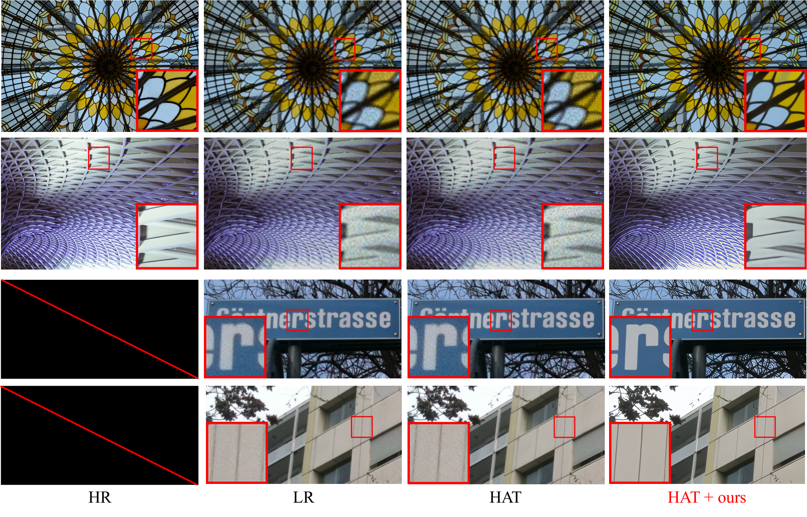
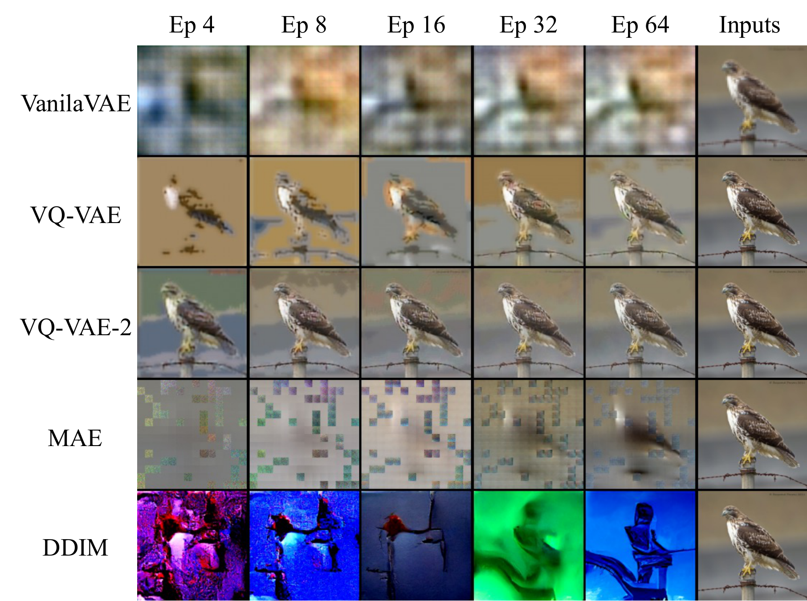
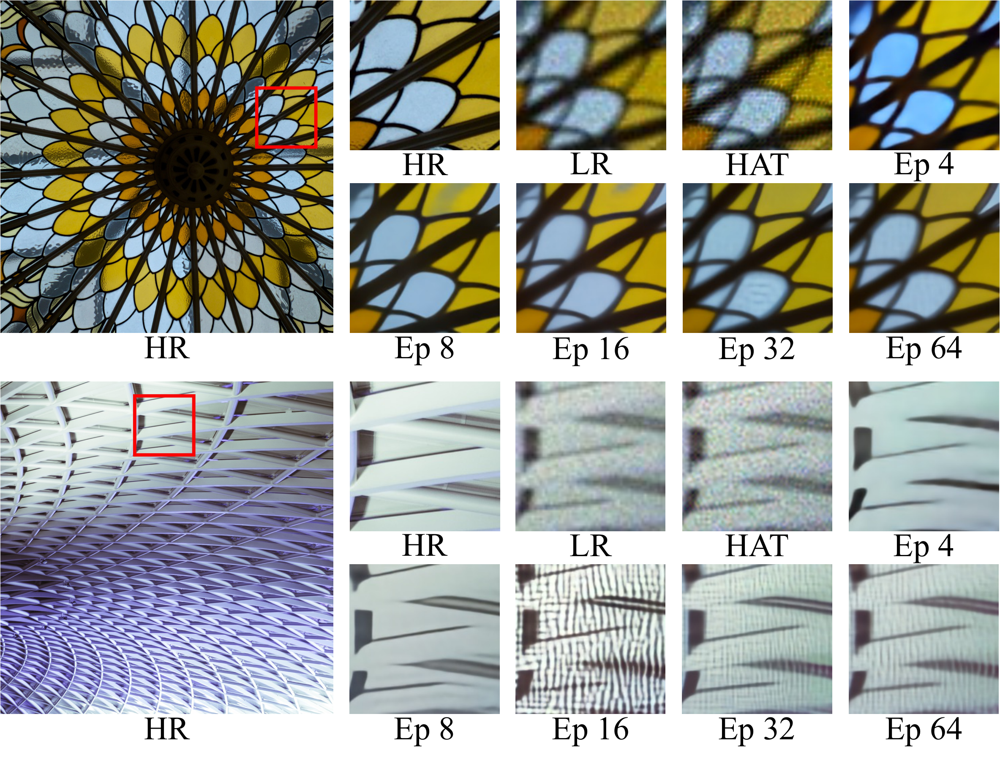
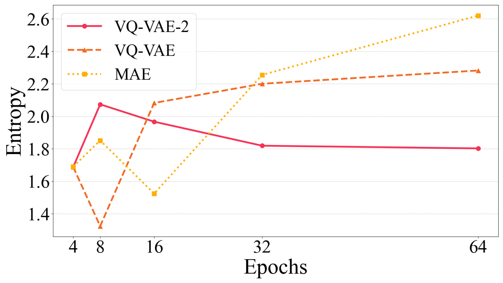
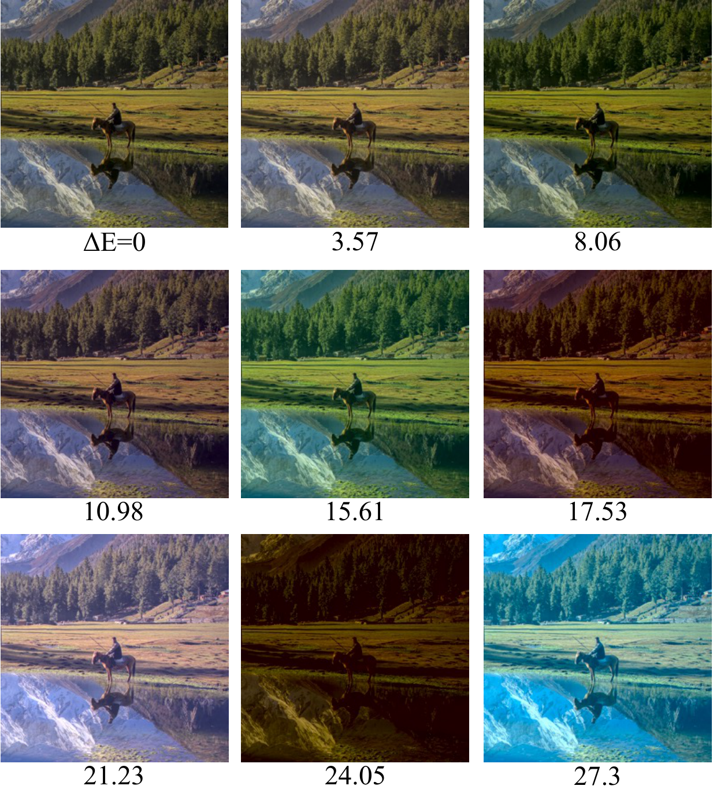
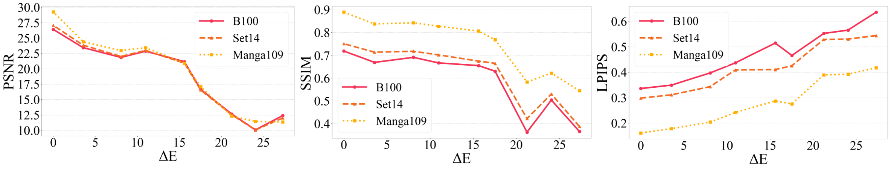

# ブラインド画像超解像における現実的な劣化のための未学習不足な画像再構成

Ru Ito^1, Supatta Viriyavisuthisakul^2, Kazuhiko Kawamoto^1, Hiroshi Kera^1,3

^1 Chiba University  
^2 King Mongkut's University of Technology Thonburi  
^3 Zuse Institute Berlin  
Corresponding authors: kera@chiba-u.jp & supatta.viri@kmutt.ac.th

## Abstract

ほとんどの超解像（super-resolution; SR）モデルは、現実世界の低解像度（low-resolution; LR）画像に対して苦戦する。この問題は、合成データセットにおける劣化特性が、現実世界の LR 画像における劣化特性と異なるために生じる。SR モデルは、ダウンサンプリングによって生成された高解像度（high-resolution; HR）画像と LR 画像のペアで訓練されるため、単純な劣化に対して最適化される。しかし、現実世界の LR 画像は、撮像過程や JPEG 圧縮などの要因によって生じる複雑な劣化を含む。これらの劣化特性の違いにより、ほとんどの SR モデルは現実世界の LR 画像に対して性能が低い。

本研究は、未学習不足な画像再構成モデルを用いるデータセット生成方法を提案する。これらのモデルは、入力画像から多様な劣化をもつ低品質画像を再構成する性質をもつ。この性質を利用して、本研究では HR 画像から多様な劣化をもつ LR 画像を生成し、データセットを構築する。我々が生成したデータセットで事前学習済み SR モデルを fine-tuning すると、ノイズ除去とぼけ低減が改善され、現実世界の LR 画像に対する性能が向上する。さらに、データセットの分析により、劣化の多様性は性能向上に寄与する一方で、HR 画像と LR 画像の間の色差は性能を低下させる可能性があることが明らかになった。

## 1 Introduction

高解像度（HR）画像はさまざまな分野で重要である。たとえば医療分野では、内部組織や構造を明瞭に捉えた MRI 画像が疾患の早期発見に不可欠である [1]。リモートセンシングでは、詳細な地理情報を提供する衛星画像が正確な天気予報に不可欠である [2]。しかし、このような画像を取得するには、高性能なカメラやレンズに加えて、継続的な維持費が必要である。低解像度（LR）画像から HR 画像を生成する技術である超解像（SR）は、コスト削減において重要な役割を果たす。

しかし、多くの SR モデル [3-12] は、現実世界の LR 画像に適用される場合、なお改善の余地がある。この問題は、合成データセットにおける劣化特性が、現実世界の LR 画像における劣化特性と大きく異なり、訓練過程に影響を与えるために生じる。これらのモデルは、HR-LR 画像ペアを用いて、SR 画像と HR 画像の誤差を最小化するように学習する。理想的には、これらのペアは撮像機器を用いて収集されるべきであるが、装置や維持の高コストによりこれは困難である。

この問題を避けるため、多くの研究 [3-12] は、bicubic 補間などの方法で HR 画像をダウンサンプリングすることにより LR 画像を生成する。したがって、ほとんどの SR モデルは、単純な劣化を含む LR 画像を高品質化するように最適化されている。対照的に、現実世界の LR 画像は、撮像や JPEG 圧縮によって生じるノイズ、ぼけ、圧縮アーティファクトを含む複雑な劣化を含む。これらの劣化特性の違いにより、ほとんどの SR モデルは現実世界の LR 画像に対して性能が低下する。

ブラインド画像超解像と呼ばれるこの課題に取り組むため、いくつかの研究 [13-23] は HR-LR 訓練ペアの構築を検討してきた。1 つの手法は、撮像デバイスを通じて HR-LR 画像ペアを収集することである。RealSR、DRealSR、SR-RAW、City100、SupER などの研究 [13-17] は、高価な機器と維持のコストをかけて画像撮影を行った。

一方で、別のアプローチは、現実世界の LR 画像から抽出した劣化を HR 画像に適用することで、疑似的な現実世界 LR 画像を生成するものである。たとえば、いくつかの研究 [18-20] は、現実世界の LR 画像から推定されたぼけやノイズを HR 画像に適用して LR 画像を生成した。さらに、他の研究 [21-23] は Generative Adversarial Network（GAN）を用いて現実世界の LR 画像における劣化分布を学習し、LR 画像を生成する。これらの方法は、現実世界の LR 画像に対する SR 性能を改善したが、なお限界がある。1 つの問題は、データセットにおけるシーンの多様性である。HR-LR ペアの収集では、データセットは最大 800 シーンに制限され、多様な現実世界のシーンを扱える SR モデルの開発を妨げる。HR-LR ペアの生成は、さまざまな HR 画像を用いることでこの問題に対処する。しかし、この方法は限られた現実世界の劣化集合のみを適用する。その結果、このようなデータセットで訓練されたモデルは、多様な現実世界の劣化に適応できず、汎化性能が低下する。

本研究では、現実世界の LR 画像に対する SR 性能を改善するため、HR 画像のみから多様な劣化をもつ LR 画像を生成する方法を提案する。鍵となる考えは、未学習不足な画像再構成モデルの出力に内在する多様な劣化を利用することである。図2に示すように、提案方法はまず HR 画像をダウンサンプリングして LR 対応画像を生成する。次に、LR 画像を未学習不足な画像再構成モデルで処理し、その出力を元の HR 画像と組にする。このデータセットで事前学習済み SR モデルを fine-tuning することで、現実世界の LR 画像に対する SR 性能が向上する。この方法は、未学習不足な画像再構成モデルの性質を利用する新しいデータセット生成アプローチを導入する。さらに、fine-tuning のみで性能向上を可能にし、費用対効果が高く、モデルに依存しない解決策を提供する。

実験では、予備実験を通じて選択した 3 つの画像再構成モデル、VAE [24]、VQ-VAE-2 [25]、MAE [26] を用いてデータセットを生成した。生成されたデータセットは、ノイズ、ringing、aliasing、ぼけを含むさまざまな劣化を含むことが確認された。fine-tuning は、EDSR [7]、ESRGAN [9]、SwinIR [11]、HAT [12] を含む事前学習済み SR モデルに対して行った。性能は NTIRE2018 Track 3 [27] と NTIRE2020 Track 2 [28] で評価した。結果は、VQ-VAE-2、特に 8 epoch の訓練で生成されたデータセットが最高性能を達成したことを示した。具体的には、SSIM は最大 0.1266 改善し、LPIPS は最大 0.0816 低下した。さらに図1に示すように、このデータセットはノイズ除去とぼけ低減に寄与した。生成データセットの追加分析により、劣化の多様性は SR 性能を改善し得ることが明らかになった。しかし、劣化の中でも、HR 画像と LR 画像の間の色差は性能に悪影響を及ぼし得る。

本研究の貢献は以下のとおりである。

- 未学習不足な画像生成モデルを活用することで、HR 画像のみを用いて多様な劣化をもつ LR 画像を生成する方法を提案する。
- 実験結果は、VQ-VAE-2 によって生成されたデータセットが、現実世界の LR 画像に対する SR 性能を改善することを示す。
- データセットにおける劣化の多様性は SR 性能を高める一方で、HR 画像と LR 画像の間の色差は性能に悪影響を及ぼし得ることを示す。

## 2 Related Work

本節では、現実世界の LR 画像に対する SR モデルの性能を高めるため、撮像機器を用いるデータセット収集と、疑似的な現実世界 LR 画像を生成する技術を検討した。

**撮像機器を用いるデータセット収集。** 最初期のデータセットの 1 つである SupER [17] は、CMOS カメラの hardware binning 技術を利用し、80,000 を超える HR-LR 画像ペアを含む。しかし、すべての画像がモノクロであり、適用可能性が制限される。対照的に、City100 [16] は Nikon DSLR と iPhone という 2 種類の異なるカメラで撮影された 100 組のカラー画像ペアから構成される。しかし、このデータセットには屋外シーンが欠けているという限界がある。これは都市シーンの印刷ポストカードを屋内で撮影して構築された。

より幅広いシーンを含めるために、SR-RAW [15] と RealSR [13] が提案された。SR-RAW は Sony ズームレンズを用いて、約 500 の屋内および屋外シーンを撮影する。RealSR は Nikon および Canon DSLR カメラを用いて収集された約 600 の屋内および屋外シーンを含む。一方、RealSR の拡張である DRealSR [14] は、Sony、Canon、Olympus、Nikon、Panasonic の 5 種類の DSLR カメラで約 800 シーンを撮影することで、データセットをさらに拡張する。これらのデータセットは、現実世界の HR-LR 画像ペアを提供する。しかし、これらのデータセットは主に建物や看板のような静的被写体を含み、動物のような動的物体は少ない。データセットにはシーン多様性が不足していたため、SR モデルが多様な現実世界のシーンを扱うことは困難であった。

**疑似的な現実世界 LR 画像の生成。** 多様な HR 画像に劣化処理を適用し、疑似的な現実世界 LR 画像を生成することで、シーン多様性を改善できる。いくつかの研究は、現実世界の LR 画像を利用するデータセット生成を提案している。たとえば [18] では、現実世界の LR 画像から推定されたぼけカーネルとノイズを HR 画像に適用して、疑似的な現実世界 LR 画像を生成する。[20] のアプローチは GAN [29] を利用して推定ぼけカーネルを拡張し、多様な劣化カーネルを生成する。さらに [19] は、GAN ベースのカーネル拡張と Stochastic Variation を組み合わせることで、生成画像に自然なランダム性を加えることができる。

HR 画像を入力とする生成モデルを用いて LR 画像を生成する方法も提案されている。たとえば [21] では、現実世界の LR 画像で訓練された GAN generator を用いて、HR 画像から LR 画像を生成する。しかし、GAN の訓練はしばしば不安定であり、画像の破綻を引き起こす。訓練安定性を改善するため、高周波成分のみに adversarial loss を適用する [22]。さらに、生成された HR 画像と LR 画像の間の色ずれを緩和するため、color attention module が導入される [23]。これらの方法は、現実世界の LR 画像を生成する点で良好に機能した。しかし、生成画像は現実世界の劣化の一部のみを捉えるため、データセット内の劣化の多様性が制限され、現実世界のシナリオに対するモデルの適応性が低下する。

我々は、HR 画像のみから多様な劣化をもつ LR 画像を生成する方法を提案する。先行研究と同様に、現実世界の LR 画像に対する性能を改善するデータセットの作成を目指す。我々の知る限り、このアプローチは既存研究では検討されていない新しい方法を導入する。

## 3 Proposed Method and Preliminary Experiments

本研究は、未学習不足な画像再構成モデルを利用するデータセット生成方法を提案する。生成されたデータセットは多様な劣化を含む。その後、このデータセットを用いて SR モデルを訓練し、現実世界の LR 画像に対する性能を改善する。

### 3.1 Dataset generation

まず、我々の提案方法は HR 画像 $\mathbf{y}$ をダウンサンプリングし、LR 画像 $\mathbf{x}$ を得る。次に、LR 画像 $\mathbf{x}$ を、$\theta$ でパラメータ化されたネットワーク $G_{\theta}:\mathbf{x} \to \mathbf{x}$ に入力する。重要な点は、未学習不足なネットワーク $G_{\theta}:\mathbf{x} \to \mathbf{x}_{\mathrm{deg}}$ を利用することで、図2に示すように、多様な劣化をもつ劣化 LR 画像 $\mathbf{x}_{\mathrm{deg}}$ を生成することである。最後に、HR 画像 $\mathbf{y}$ と劣化 LR 画像 $\mathbf{x}_{\mathrm{deg}}$ を組にすることで、データセット $\mathcal{D}$ を構築する。データセットは以下のように表される。

$$
\mathcal{D} = \{(\mathbf{x}^i_{\mathrm{deg}}, \mathbf{y}^i)\}^{|\mathcal{D}|}_{i=1}
$$

ここで、$i$ はデータセット $\mathcal{D}$ 内の各データペアに対応するインデックスを表す。このデータセットで事前学習済み SR モデル $f_{\theta}$ を fine-tuning することで、現実世界の LR 画像に対する SR 性能が向上する。

### 3.2 Performance Comparison of Image Reconstruction Models

予備実験として、この方法に適したモデルを選択するため、代表的な画像再構成モデルの性能を比較する。入力の構造情報を保持するだけでなく、現実世界の LR 画像に類似した劣化も保持する画像を再構成する能力を重視した。以下では実験設定と結果を述べる。

**Setup.** 実験では、VanillaVAE [30]、VQ-VAE [24]、VQ-VAE-2 [25]、MAE [26]、DDIM [31] という 5 つの画像再構成モデルを用いた。これらのモデルは、ImageNet [32] から抽出された 45,000 画像を含む Tiny-ImageNet を用いて、4、8、16、32、64 epoch 訓練された。図3では、結果のサンプルにより、すべてのモデルで訓練 epoch 数が不十分であることを確認した。各モデルの入力画像サイズは、VanillaVAE が 64$\times$64、MAE が 224$\times$224、VQ-VAE、VQ-VAE-2、DDIM が 256$\times$256 に設定された。MAE は、マスク領域のみではなく画像全体を再構成するように構成された。DDIM の sampling step 数は 100 に設定された。画像再構成に適したモデルが存在しないため、GAN ベースのモデル [29] は使用しなかった。比較は、再構成画像の定性的評価によって行った。

**Results.** 5 つの画像再構成モデルの性能を比較し、提案方法で使用するモデルとして VQ-VAE、VQ-VAE-2、MAE を選択した。図3は各モデルの再構成結果を示す。右端の列は入力画像を示し、他の列は異なる訓練 epoch における再構成画像を示す。結果は、VanillaVAE と DDIM による再構成が入力画像と大きく異なることを示している。

VanillaVAE の再構成品質が低いことは、その表現能力の制限に起因すると考えられる。具体的には、VanillaVAE は潜在空間を標準正規分布に制約するため、顔画像のような比較的単純な構造の再構成には有効である。しかし、この単純な潜在表現は ImageNet [32] のような複雑で多様なデータセットには不十分であり、再構成性能の大幅な低下につながる。

DDIM については、再構成品質の低さは reverse process におけるノイズ除去の不安定性に起因する。十分な訓練がない場合、reverse process におけるノイズ予測が不安定になり、各 step で累積誤差が生じる。その結果、再構成画像は入力と大きく異なる。MAE は、少ない epoch で訓練された場合、入力と大きく異なる再構成を生成する。しかし、32 および 64 epoch では、構造情報と色情報をある程度捉える。同様に、VQ-VAE と VQ-VAE-2 は、最小限の訓練でも、劣化を取り込みながら比較的正確に画像を再構成できる。これらの知見に基づき、本研究では、構造情報を保持しつつ劣化を導入できるモデルとして、VQ-VAE、VQ-VAE-2、MAE を用いてデータセットを生成する。

## 4 Experiments

本節では、未学習不足な画像再構成モデルを用いたデータセット生成と、事前学習済み SR モデルの fine-tuning に関する実験設定および結果を示す。さらに、データセットを分析し、その有効性について議論する。

### 4.1 Dataset generation

**Setup.** 現実世界の LR 画像に対する SR 性能を改善するため、VQ-VAE、VQ-VAE-2、MAE という 3 つの画像再構成モデルを用いて訓練データセットを生成する。これら 3 つのモデルは、Section 3.2 の実験設定に従い、未学習不足である。前処理として、DF2K（DIV2K + Flickr2K）[33] データセットの HR 画像を 1,024 × 1,024 に crop し、約 20,000 枚の画像を準備する。その後、これらの画像を scale factor 4 でダウンサンプリングする。

図4は、各モデルによって生成された LR 画像の例を示す。右端の列は入力画像に対応し、他の列は各モデルからの再構成画像を示す。すべてのモデルにおいて、再構成画像は入力の構造情報を保持しつつ劣化を取り込んでいる。VQ-VAE-2 は訓練 epoch 数にかかわらず、入力に近い画像を再構成する。VQ-VAE は黄色がかった色合いの画像を生成する傾向があり、MAE は疎な劣化を導入する。これらの結果は、各モデルが異なる特徴をもつ劣化画像を生成することを確認する。

さらに図5は、8 epoch 訓練された VQ-VAE-2 によって生成されたデータセットの LR 画像例を示す。各 pane の最初の 2 列は入力画像とその拡大表示を示し、最後の列はさまざまな種類の劣化をもつ再構成画像を表示する。(a) では、レンガの色が赤と緑にわたって変化し、ノイズを導入している。(b) では、桜の輪郭がぼけて見え、ぼけの存在を示している。(c) では、アヒルの頭部周辺にリング状のアーティファクトが見られ、ringing が生じている。(d) では、屋根の直線に沿って jagged edge が現れ、aliasing を示している。これらの結果は、提案方法が多様な種類の劣化を含むデータセットを生成できることを示す。

### 4.2 Fine-tuning pre-trained models

現実世界の LR 画像に対する SR 性能を高める有効性を評価するため、生成データセットを用いて事前学習済み SR モデル HAT [12] を fine-tuning した。結果は、VQ-VAE-2 によって生成されたデータセットの有効性を示す。さらに、その一般的な適用可能性を検証するため、同じデータセットを用いて、EDSR [7]、ESRGAN [9]、SwinIR [11] という 3 つの事前学習済み SR モデルを追加で fine-tuning した。性能評価は NTIRE2018 Track 3 [27] と NTIRE2020 Track 2 [28] データセットを用いて行った。

#### 4.2.1 Validation of Dataset Effectiveness

有効性を評価するため、VQ-VAE、VQ-VAE-2、MAE によって生成されたデータセットを用いて、事前学習済み HAT モデルを fine-tuning した。NTIRE2018 Track 3 における定量評価結果を表1に示す。各列の最良値は赤、2 番目に良い値は青で強調される。

VQ-VAE-2 生成データセットは SR 性能を改善することを示せる。具体的には、4、8、32、64 epoch の訓練から得られたデータセットで fine-tuning すると、SSIM と LPIPS が改善した。特に、8 epoch のデータセットは SSIM を 0.0951 points、LPIPS を 0.0371 points 改善した。

図6は、VQ-VAE-2 生成データセットで fine-tuning されたモデルの定性的評価を示す。これは、赤で強調された領域を拡大することで、HR、LR、SR 画像を比較する。結果は、事前学習済みモデル HAT からの SR 画像がノイズとぼけを保持する一方で、fine-tuning されたモデルはこれらのアーティファクトを低減することを示す。特に、8 epoch のデータセットで訓練されたモデルは、アーティファクトが少なく視覚品質の高い画像を生成し、HR 画像に近い。しかし、4 epoch のデータセットで fine-tuning されたモデルはノイズとぼけをうまく低減する一方で、高彩度の画像を生成する傾向がある。16、32、64 epoch のデータセットで fine-tuning されたモデルは、目立つアーティファクトを示す。

図1は、最大の改善を示した 8 epoch のデータセットで fine-tuning されたモデルの定性的評価を示す。この図は、事前学習済み HAT モデルが LR 画像のノイズとぼけを保持する一方で、fine-tuning されたモデルがノイズを効果的に低減し、鮮明さを復元したことを示す。これらの結果は、VQ-VAE-2 によって生成されたデータセット、特に 8 epoch のものが、現実世界の LR 画像に対する SR 性能の改善に有効であることを示す。

**表1. 提案データセットを用いた事前学習済み HAT の fine-tuning 結果。**

| Generative Model | Dataset | PSNR↑ | SSIM↑ | LPIPS↓ |
|---|---:|---:|---:|---:|
| VQ-VAE | Ep 4 | 12.92 | 0.4394 | 0.7453 |
| VQ-VAE | Ep 8 | 12.68 | 0.4067 | 0.7296 |
| VQ-VAE | Ep 16 | 12.91 | 0.4038 | 0.6891 |
| VQ-VAE | Ep 32 | 11.48 | 0.4151 | 0.6855 |
| VQ-VAE | Ep 64 | 9.345 | 0.2886 | 0.6753 |
| VQ-VAE-2 | Ep 4 | 16.68 | 0.5077 | 0.6386 |
| VQ-VAE-2 | Ep 8 | 18.10 | 0.5288 | 0.5977 |
| VQ-VAE-2 | Ep 16 | 15.83 | 0.2848 | 0.6410 |
| VQ-VAE-2 | Ep 32 | 17.92 | 0.4435 | 0.6036 |
| VQ-VAE-2 | Ep 64 | 18.13 | 0.4968 | 0.5901 |
| MAE | Ep 4 | 10.99 | 0.2742 | 0.7164 |
| MAE | Ep 8 | 11.38 | 0.3007 | 0.7226 |
| MAE | Ep 16 | 11.04 | 0.2471 | 0.7133 |
| MAE | Ep 32 | 11.53 | 0.2625 | 0.6904 |
| MAE | Ep 64 | 15.72 | 0.4404 | 0.6348 |
| w/o fine-tune | - | 18.24 | 0.4337 | 0.6272 |

#### 4.2.2 Validation of Dataset Generalization

VQ-VAE-2 によって生成されたデータセットにより、現実世界の LR 画像に対する SR モデルの性能は改善される。このデータセットがモデル非依存であることを示すため、EDSR [7]、ESRGAN [9]、SwinIR [11] を fine-tuning した。

表2は、NTIRE2018 Track 3 を用いた定量評価を示す。各列の最高値は赤で、2 番目に高い値は青で強調される。この表は、VQ-VAE-2 生成データセットが 3 つすべてのモデルで SSIM と LPIPS を改善し、その一般的適用可能性を確認することを示す。特に、8 epoch のデータセットで fine-tuning した場合、EDSR は SSIM を 0.0871 points、LPIPS を 0.0138 points 改善する。ESRGAN は SSIM で 0.1266 points、LPIPS で 0.0816 points の改善を示し、SwinIR は SSIM で 0.0503 points の増加を達成する。

図7は、8 epoch のデータセットで fine-tuning されたモデルの定性的評価を示す。事前学習済み EDSR、ESRGAN、SwinIR モデルによって生成された SR 画像は、残留ノイズとぼけを示す。対照的に、このデータセットでモデルを fine-tuning するとノイズとぼけが低減され、より高品質な SR 画像につながる。これらの結果は、VQ-VAE-2 生成データセットの有効性が SR モデルに依存しないことを示す。

**表2. VQ-VAE-2 生成データセットを用いた事前学習済み EDSR、ESRGAN、SwinIR の fine-tuning 結果。**

| Dataset | EDSR PSNR↑ | EDSR SSIM↑ | EDSR LPIPS↓ | ESRGAN PSNR↑ | ESRGAN SSIM↑ | ESRGAN LPIPS↓ | SwinIR PSNR↑ | SwinIR SSIM↑ | SwinIR LPIPS↓ |
|---:|---:|---:|---:|---:|---:|---:|---:|---:|---:|
| Ep 4 | 16.35 | 0.5034 | 0.6691 | 14.80 | 0.2715 | 0.6513 | 16.15 | 0.4903 | 0.6496 |
| Ep 8 | 18.16 | 0.5238 | 0.6123 | 16.60 | 0.3981 | 0.5814 | 17.70 | 0.4842 | 0.6169 |
| Ep 16 | 16.66 | 0.3599 | 0.6327 | 16.07 | 0.3765 | 0.6007 | 15.64 | 0.2835 | 0.6409 |
| Ep 32 | 17.15 | 0.3786 | 0.6131 | 15.50 | 0.3918 | 0.5932 | 16.94 | 0.4187 | 0.6089 |
| Ep 64 | 17.55 | 0.3840 | 0.6140 | 15.02 | 0.2697 | 0.6424 | 17.90 | 0.4392 | 0.6051 |
| w/o fine-tune | 18.23 | 0.4367 | 0.6261 | 17.64 | 0.2715 | 0.6630 | 18.23 | 0.4339 | 0.6275 |

### 4.3 Analysis of datasets

本節では、提案方法によって生成されたデータセットを分析し、その有効性または非有効性に寄与した要因について議論する。

#### 4.3.1 Degradation Diversity

我々の各データセットにおける劣化の多様性を定量評価し、有効性との関係を議論する。この評価は、現実世界の LR 画像におけるさまざまな劣化を扱える SR モデルを構築するには、類似した劣化多様性をもつ訓練データセットが必要であるという考えに基づく。劣化多様性は、値が大きいほど多様性が大きいことを示す以下の entropy $H$ によって定義される。

$$
H = - \sum_{\mathbf{x} \in \mathcal{X}} P(\mathbf{x}) \log P(\mathbf{x})
$$

ここで、$\mathcal{X}$ は画像劣化クラスの集合を表す。$P(\cdot)$ はデータセット内の各劣化クラスの比率を表し、劣化を分類できる画像分類モデルを用いて得られる。

ここでは、Gaussian blur、Gaussian noise、JPEG compression を含む 15 種類の劣化を含む Tiny-ImageNet-C データセットで事前学習された ResNet-152 [34] モデルを用いた。各劣化クラスは 2,000 画像から構成される。

図8は各データセットの entropy を示す。横軸は訓練 epoch 数を表し、縦軸は score を示す。8 epoch の VQ-VAE-2 によって生成されたデータセットは、同じモデルによって生成されたデータセットの中で最も高い entropy を示し、高い劣化多様性を示した。このデータセットで fine-tuning されたモデルは最高の SR 性能を達成しており、劣化多様性が性能改善に寄与することを示唆する。しかし、32 および 64 epoch の VQ-VAE と MAE のデータセットは高い entropy を示したにもかかわらず、SR モデルの性能を改善できなかった。これは、これらのデータセットが SR 性能に悪影響を与える劣化を含んでいる可能性を示唆する。

#### 4.3.2 Color Difference

Section 4.3.1 から、VQ-VAE と MAE のデータセットは多様な劣化を含む。しかし、これらのデータセットは現実世界の LR 画像に対する SR 性能を改善しなかった。先行研究 [23] は、HR 画像と LR 画像の間の色差が訓練性能を低下させ得ることを報告した。この知見に基づき、VQ-VAE および MAE 生成データセットは大きな色差を含み、それが性能低下を引き起こした可能性があると仮定する。

この仮説を検証するため、2 つの実験を行う。第一に、VQ-VAE、VQ-VAE-2、MAE からのデータセットにおける色差を定量評価し、これらのデータセットがより大きな色差を示すという仮定を検証する。第二に、色差をもつデータセットで訓練された SR モデルを評価し、そのような差が訓練に悪影響を与えることを示す。

**Pre-processing and evaluation metric.** 2 つの画像のサイズが異なる場合、色差を計算できないため、HR 画像を bicubic 法でダウンサンプリングし、LR 画像のサイズに合わせた。ダウンサンプリングによって生じる色差は無視できるものとみなした。色差は、Python library `skimage` の `color.deltaE_ciede2000` module を用い、LAB 色空間における CIEDE2000 metric [35] を採用して計算する。

**Color difference analysis of the generated datasets.** 3 つのモデルによって生成されたデータセット間で色差を比較した結果、VQ-VAE と MAE のデータセットは VQ-VAE-2 のデータセットよりも大きな色差を示すことが明らかになった。図9は実験結果を示し、横軸は訓練 epoch 数、縦軸は HR 画像と LR 画像の間の色差 $\Delta \mathrm{E}$ を示す。結果は、VQ-VAE と MAE によって生成されたデータセットが訓練初期段階から顕著な色差を示し、64 epoch に達した後もこれらの差が残ることを示す。対照的に、VQ-VAE-2 からのデータセットは初期段階からより小さな色差を示し、最終的にはそれらを半分未満に低減した。

**Impact of color differences on training.** 次に、色差が SR モデルの訓練に悪影響を与えることを示す。実験では、9 つのデータセットを用いて、SwinIR [11] モデルを 500,000 iteration で scratch から訓練する。1 つのデータセットは、色差のない bicubic ダウンサンプリングによって生成された LR 画像と HR 画像のペアから構成される。残り 8 つのデータセットは、LAB 色空間で LR 画像の色をずらすことによって導入された色差を示す。

図10は、各データセットからの LR 画像例を示す。左上の画像は、色ずれを導入しない bicubic ダウンサンプリング LR 画像であり、他の画像は LAB 色空間で適用された色ずれをもつ LR 画像である。下部に表示された $\Delta \mathrm{E}$ 値は、各データセット全体の平均色差を示す。DF2K [33] を HR データセットとして使用し、モデルは Set14 [36]、B100 [37]、Manga109 [38] という 3 つの benchmark dataset を用いて評価した。

図11は、これらのデータセットで訓練された SwinIR モデルの評価結果を示す。横軸はデータセット全体の平均色差を表し、縦軸は metric values を表す。結果は、色差が増加するにつれて、すべての評価 metric score が悪化することを示す。これらの知見は、SR データセットにおける HR 画像と LR 画像の間の色差が訓練に悪影響を与えることを確認する。これらの結果に基づき、VQ-VAE と MAE からのデータセットは大きな色差を示し、それが低い訓練性能に寄与している可能性が高い。

分析は、データセットにおける多様な劣化が現実世界の LR 画像に対する SR 性能を高め得ることを示す。しかし、これらの劣化の中でも、色差は訓練性能に悪影響を与える可能性があり、データセットから除外されるべきである。

## 5 Conclusion

本研究は、未学習不足な画像再構成モデルを利用するデータセット生成方法を提案した。このアプローチにより、HR 画像のみを用いて多様な劣化をもつ LR 画像を生成できる。さらに、VQ-VAE-2 [25] によって生成されたデータセット、特に 8 epoch 訓練されたものを用いて既存の SR モデルを fine-tuning すると、さまざまな評価 metric が改善し、ぼけが低減され、ノイズが除去される。

加えて、生成データセットの分析により、多様な劣化を取り入れることが現実世界の LR 画像に対する SR 性能の改善に寄与することが明らかになった。しかし、これらの劣化の中でも、HR 画像と LR 画像の間の色差は訓練性能に悪影響を与える可能性がある。今後の研究では、VQ-VAE-2 が有効なデータセットを生成する機構の分析に焦点を当てる。

**Acknowledgement.** This work was supported by JSPS KAKENHI Grant Number JP23K24914 and JP22K17962, Japan.

## References

[1] S. Minwoo, S. Minjee, L. Kyunghyun, and Y. Kyungho, "Super-resolution techniques for biomedical applications and challenges," *Biomedical Engineering Letters*, vol. 14, pp. 465-496, 2024.

[2] C. Jianxin, K. Qiuming, S. Chenkai, L. Jin, T. Xicheng, and L. Wang, "Reslap: Generating high-resolution climate prediction through image super-resolution," *IEEE Access*, vol. 8, pp. 39,623-39,634, 2020.

[3] C. Dong, C. C. Loy, K. He, and X. Tang, "Image super-resolution using deep convolutional networks," *IEEE Transactions on Pattern Analysis and Machine Intelligence*, vol. 38, pp. 295-307, 2015.

[4] C. Dong, C. C. Loy, and X. Tang, "Accelerating the super-resolution convolutional neural network," in *Proceedings of the European Conference on Computer Vision*, 2016, pp. 391-407.

[5] J. Kim, J. K. Lee, and K. M. Lee, "Accurate image super-resolution using very deep convolutional networks," in *Proceedings of the IEEE/CVF Conference on Computer Vision and Pattern Recognition*, 2016, pp. 1646-1654.

[6] W. Shi et al., "Real-time single image and video super-resolution using an efficient sub-pixel convolutional neural network," in *Proceedings of the IEEE/CVF Conference on Computer Vision and Pattern Recognition*, 2016, pp. 1874-1883.

[7] B. Lim, S. Son, H. Kim, S. Nah, and K. M. Lee, "Enhanced deep residual networks for single image super-resolution," in *Proceedings of the IEEE/CVF Conference on Computer Vision and Pattern Recognition Workshop*, 2017, pp. 136-144.

[8] C. Ledig et al., "Photo-realistic single image super-resolution using a generative adversarial network," in *Proceedings of the IEEE/CVF Conference on Computer Vision and Pattern Recognition*, 2017, pp. 4681-4690.

[9] X. Wang et al., "Esrgan: Enhanced super-resolution generative adversarial networks," in *Proceedings of the European Conference on Computer Vision Workshop*, 2018, pp. 0-0.

[10] Y. Zhang et al., "Image super-resolution using very deep residual channel attention networks," in *Proceedings of the European Conference on Computer Vision*, 2018, pp. 286-301.

[11] J. Liang et al., "Swinir: Image restoration using swin transformer," in *Proceedings of the IEEE/CVF International Conference on Computer Vision*, 2021, pp. 833-1844.

[12] X. Chen, X. Wang, J. Zhou, Y. Qiao, and C. Dong, "Activating more pixels in image super-resolution transformer," in *Proceedings of the IEEE/CVF Conference on Computer Vision and Pattern Recognition*, 2023, pp. 22,367-22,377.

[13] J. Cai, H. Zeng, H. Yong, Z. Cao, and L. Zhang, "Toward real-world single image super-resolution: A new benchmark and a new model," in *Proceedings of the IEEE/CVF International Conference on Computer Vision*, 2020, pp. 3086-3095.

[14] P. Wei et al., "Component divide-and-conquer for real-world image super-resolution," in *Proceedings of the European Conference on Computer Vision*, 2020, pp. 101-117.

[15] X. C. Zhang, Q. Chen, R. Ng, and V. Koltun, "Zoom to learn, learn to zoom," in *Proceedings of the IEEE/CVF Conference on Computer Vision and Pattern Recognition*, 2019, pp. 3757-3765.

[16] C. Chen, Z. Xiong, X. Tian, Z.-J. Zha, and F. Wu, "Camera lens super-resolution," in *Proceedings of the IEEE/CVF Conference on Computer Vision and Pattern Recognition*, 2019, pp. 1652-1660.

[17] T. Köhler et al., "Toward bridging the simulated-to-real gap: Benchmarking super-resolution on real data," *IEEE Transactions on Pattern Analysis and Machine Intelligence*, vol. 42, pp. 2944-295, 2019.

[18] X. Ji1, Y. Cao, Y. Tai, C. Wang, J. Li, and F. Huang, "Real-world super-resolution via kernel estimation and noise injection," in *Proceedings of the IEEE/CVF Conference on Computer Vision and Pattern Recognition Workshop*, 2020, pp. 466-467.

[19] Z. Haiyu, Z. Yu, S. Jinqiu, and Z. Yanning, "Real-world image super-resolution via kernel augmentation and stochastic variation," in *Proceedings of the IEEE/CVF International Conference on Image Processing*, 2022, pp. 2506-2510.

[20] R. Zhou and S. Susstrunk, "Kernel modeling super-resolution on real low-resolution images," in *Proceedings of the IEEE/CVF International Conference on Computer Vision*, 2019, pp. 2433-2443.

[21] A. Bulat, J. Yang, and G. Tzimiropoulos, "To learn image super-resolution, use a gan to learn how to do image degradation first," in *Proceedings of the European Conference on Computer Vision*, 2018, pp. 185-200.

[22] M. Fritsche, S. Gu, and R. Timofte, "Frequency separation for real-world super-resolution," in *Proceedings of the IEEE/CVF International Conference on Computer Vision Workshop*, 2019, pp. 3599-3608.

[23] Y. Zhou, W. Deng, T. Tong, and Q. Gao, "Guided frequency separation network for real-world super-resolution," in *Proceedings of the IEEE/CVF Conference on Computer Vision and Pattern Recognition Workshop*, 2020, pp. 428-429.

[24] A. van den Oord, O. Vinyals, and K. Kavukcuoglu, "Neural discrete representation learning," in *Advances in Neural Information Processing Systems*, vol. 30, 2017.

[25] A. Razavi, A. van den Oord, and O. Vinyals, "Generating diverse high-fidelity images with vq-vae-2," in *Advances in Neural Information Processing Systems*, vol. 32, 2019.

[26] K. He et al., "Masked autoencoders are scalable vision learners," in *Proceedings of the IEEE/CVF Conference on Computer Vision and Pattern Recognition*, 2022, pp. 16,000-16,009.

[27] R. Timofte et al., "Ntire 2018 challenge on single image super-resolution: Methods and results," in *Proceedings of the IEEE/CVF Conference on Computer Vision and Pattern Recognition Workshop*, 2018, pp. 852-863.

[28] A. Lugmayr et al., "Ntire 2020 challenge on real-world image super-resolution: Methods and results," in *Proceedings of the IEEE/CVF Conference on Computer Vision and Pattern Recognition Workshop*, 2020, pp. 2058-2076.

[29] I. J. Goodfellow et al., "Generative adversarial nets," in *Advances in Neural Information Processing Systems*, vol. 27, 2014.

[30] D. P. Kingma and M. Welling, "Auto-encoding variational bayes," *arXiv preprint arXiv:1312.6114*, 2013.

[31] J. Song, C. Meng, and S. Ermon, "Denoising diffusion implicit models," *arXiv preprint arXiv:1312.6114*, 2020.

[32] J. Deng et al., "Imagenet: A large-scale hierarchical image database," in *Proceedings of the IEEE/CVF Conference on Computer Vision and Pattern Recognition*, 2009, pp. 248-255.

[33] E. Agustsson and R. Timofte, "Ntire 2017 challenge on single image super-resolution: Dataset and study," in *Proceedings of the IEEE/CVF Conference on Computer Vision and Pattern Recognition Workshop*, 2017, pp. 126-135.

[34] H. Kaiming, Z. Xiangyu, R. Shaoqing, and S. Jian, "Deep residual learning for image recognition," in *Proceedings of the IEEE/CVF Conference on Computer Vision and Pattern Recognition*, 2016, pp. 770-778.

[35] CIE, "Improvement to industrial colour-difference evaluation," *Vienna:CIE Publication No. 142-2001*, 2021.

[36] R. Zeyde, M. Elad, and M. Protter, "On single image scale-up using sparse-representations," in *International Conference on Curves and Surfaces*, 2010, pp. 711-730.

[37] D. R. Martin, C. C. Fowlkes, D. Tal, and J. Malik, "A database of human segmented natural images and its application to evaluating segmentation algorithms and measuring ecological statistics," in *Proceedings of the IEEE/CVF International Conference on Computer Vision*, 2001, pp. 416-423.

[38] Y. Matsui et al., "Sketch-based manga retrieval using manga109 dataset," *Multimedia Tools and Applications*, vol. 76, pp. 21,811-21,838, 2015.
